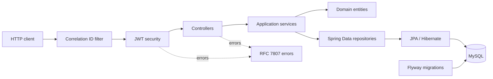
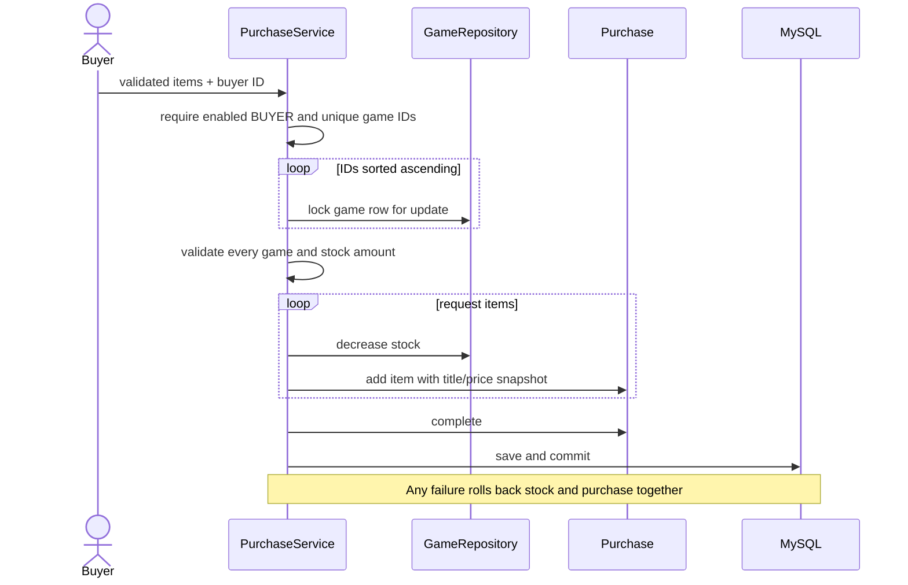

# Game Store: Simple OOP and Architecture Guide

> Reviewed project: `C:\Users\Vlad\Documents\GitHub\API-store-management-tool`  
> Scope: all 113 project files, excluding generated `target/**` and internal `.git/**` files.  
> Local secret values are not shown.

## 1. What this project is

This is one Spring Boot backend for an online game store:

- Buyers register, log in, browse games, buy stock, and see their own purchases.
- Managers log in, create/update/deactivate games, inspect inventory, and view sales statistics.
- MySQL stores users, games, purchases, and purchase items.

It is **not a system of multiple microservices**. Authentication, games, purchasing, and reporting are packages inside one application. They run in one JVM, use one database, and can share one transaction.

Why use one service here?

- Checkout can update stock and create a purchase atomically.
- Deployment and testing are simple.
- Database foreign keys protect all related data.

The tradeoff is that every feature is deployed and scaled together. The packages are useful boundaries, but they are not independent network services.

## 2. Main architecture

### Package responsibilities

| Package | Why it exists | How it works |
|---|---|---|
| `auth` | Registration, login, and JWT issuing | Controller validates input; service hashes/checks passwords and issues tokens |
| `user` | Account identity and roles | JPA entity plus repository |
| `game` | Catalog, game management, and inventory | Controllers call services; specifications and repository queries read games |
| `purchase` | Checkout, history, and reporting | Transactional service locks stock and creates purchase aggregates |
| `config` | Security and external settings | Spring beans and validated configuration records |
| `bootstrap` | Initial manager account | Startup runner calls an idempotent transactional service |
| `error` | Consistent API failures and request tracing | Filter, security handlers, and global exception advice |
| `common` | Shared domain-error categories | Sealed exception hierarchy |

### Request path

1. `CorrelationIdFilter` accepts a safe `X-Correlation-ID` or generates a UUID.
2. Spring Security verifies a bearer JWT and role.
3. A controller validates HTTP input and calls a service.
4. The service opens a read-only or write transaction.
5. Entities enforce their own rules; repositories read/write through JPA.
6. A response record is returned. JPA entities are never returned directly.
7. Failures become a consistent `application/problem+json` response.

This separation matters because HTTP, business, and persistence rules change for different reasons.

## 3. Data model

| Table/entity | Purpose | Important relationship |
|---|---|---|
| `app_users` / `UserAccount` | Login identity, password hash, role, enabled state | One buyer can own many purchases |
| `games` / `Game` | Product data, price, stock, activity, version | A game can appear in many purchase items |
| `purchases` / `Purchase` | Buyer order, status, total, EUR currency | Owns one or more items |
| `purchase_items` / `PurchaseItem` | Quantity and historical item facts | Belongs to one purchase and references one game |

`PurchaseItem` stores the game title and price at checkout time. If a manager changes the game later, old receipts and revenue remain correct.

Games use soft deletion: `deactivate()` sets `active=false` instead of deleting the row. This preserves purchase history and foreign keys.

Flyway owns schema changes. Hibernate uses `ddl-auto=validate`, so it checks mappings but does not create or change production tables.

## 4. OOP principles actually used

| Principle | Where | Why and how |
|---|---|---|
| Encapsulation | `Game`, `Purchase`, `PurchaseItem`, `UserAccount` | Fields are private and changed through methods that reject invalid price, stock, status, role, or text |
| Abstraction | Services and repositories | Controllers ask for business operations; they do not know JPQL, locking, or password/JWT details |
| Inheritance | `StoreDomainException` and framework base types | Feature exceptions inherit a controlled error category; the correlation filter extends Spring's once-per-request filter |
| Polymorphism | Repository/projection/security interfaces | Spring supplies runtime implementations and calls them through interfaces |
| Composition | Controllers, services, purchase items | Objects contain injected collaborators; a purchase owns items instead of using deep inheritance |
| Immutability | Request/response/property records | Boundary data cannot be reassigned; purchase request lists are defensively copied |
| Dependency injection | Constructors and `@Bean` methods | Dependencies are visible, replaceable in tests, and created by Spring |

### Important examples

- [`Game.java`](<C:/Users/Vlad/Documents/GitHub/API-store-management-tool/game-store-api/src/main/java/com/gamestore/game_store_api/game/Game.java:104>) owns price, stock, and activation rules. A caller cannot set fields directly.
- [`Purchase.java`](<C:/Users/Vlad/Documents/GitHub/API-store-management-tool/game-store-api/src/main/java/com/gamestore/game_store_api/purchase/Purchase.java:86>) is an aggregate root. It owns items, total calculation, and `PENDING` state checks.
- [`StoreDomainException.java`](<C:/Users/Vlad/Documents/GitHub/API-store-management-tool/game-store-api/src/main/java/com/gamestore/game_store_api/common/StoreDomainException.java:6>) uses a sealed hierarchy so errors have known categories.
- [`GameRepository.java`](<C:/Users/Vlad/Documents/GitHub/API-store-management-tool/game-store-api/src/main/java/com/gamestore/game_store_api/game/GameRepository.java:15>) is an interface; Spring generates its implementation.
- Response records hide persistence details and sensitive entity fields from API clients.

### SOLID, briefly

- **Single Responsibility:** controllers handle HTTP, services coordinate use cases, entities protect local rules, repositories handle persistence.
- **Open/Closed:** game filters compose through specifications. New filters can be added without writing every query combination.
- **Liskov Substitution:** Spring repository/security implementations can be used through their declared interfaces.
- **Interface Segregation:** query projections contain only fields needed by a particular report.
- **Dependency Inversion:** services depend on repository and security interfaces. This is partial because controllers use concrete service classes, which is reasonable for this small application.

Do not overstate SOLID: there are no multiple business strategies or deep domain hierarchies. Most polymorphism comes from Spring interfaces.

## 5. Main design patterns

| Pattern | Why | How |
|---|---|---|
| Controller-Service-Repository | Separate protocol, use-case, and database code | HTTP controllers call transactional services, which call repositories |
| DTO | Protect API contracts | Records map requests/responses instead of exposing entities |
| Aggregate | Keep purchase and items consistent | `Purchase` alone adds items and completes the order |
| Specification | Avoid many search methods | Optional game filters are composed dynamically |
| Projection | Query summaries efficiently | Spring maps JPQL aliases to small `*View` interfaces |
| Soft delete | Preserve history | Games are made inactive rather than removed |
| Exception translation | Keep HTTP outside domain logic | Services throw feature exceptions; advice maps them to problem responses |
| Dependency injection | Make wiring and tests simple | Constructor arguments supply repositories, encoders, clock, and properties |

## 6. Security and authentication

### Registration

1. The request record validates email, name, and password shape.
2. `AuthenticationService` enforces BCrypt's 72-byte limit.
3. It checks duplicate email, BCrypt-hashes the password, and creates a `BUYER`.
4. The database unique key catches simultaneous duplicate registrations.
5. The response contains safe account fields, never the password hash.

### Login

1. The service loads the account by email.
2. It always runs a password comparison, using a dummy hash when the email is unknown. This reduces timing-based email discovery.
3. Invalid, missing, or disabled accounts receive the same failure.
4. `JwtTokenService` issues a one-hour HS256 token with subject, user ID, role, issuer, audience, and expiry.
5. Later requests validate signature, issuer, audience, expiry, and role.

The API is stateless: no server session, form login, HTTP Basic, or logout endpoint. V1 also has no refresh token or revocation. A token can remain usable until expiry after a role/status change, although purchase operations re-check the buyer in the database.

## 7. Game and inventory logic

### Catalog

`CatalogController` validates search parameters. `GameService` validates price range and whitelists sort names. `GameSpecifications` combines optional title/SKU/description, genre, platform, price, and activity filters. Results use pagination and an ID tie-breaker for stable ordering.

Important inconsistency: single-game lookup requires an active game, but general search only applies the activity condition when `active` is supplied. An omitted filter can therefore include inactive games even though documentation calls it an active catalog.

### Manager changes

- Create checks SKU before insert and catches the database race.
- Price changes go through `Game.changePrice`.
- Stock accepts absolute quantity and a temporary legacy `delta`.
- Deactivation is idempotent and keeps history.
- `@Version` detects optimistic update conflicts.

### Inventory

Inventory search includes active and inactive games. Database queries calculate counts, units, low/out-of-stock games, and inventory value instead of loading every row into Java.

## 8. Purchase logic

Checkout is the most important transaction:

Why sorted locks? Two multi-game checkouts acquire rows in the same order, reducing deadlock risk.

Why pessimistic locks? Two buyers cannot both purchase the last unit.

Why validate all games before mutation? A bad second line cannot leave the first game's stock changed.

History is scoped by buyer ID. Detailed lookup queries by both purchase ID and buyer ID, so another buyer receives 404 instead of learning that the purchase exists.

Statistics aggregate completed purchases and historical line totals in the database. Inclusive end dates are converted to the next midnight exclusive, avoiding time-precision errors. The response mixes date-filtered sales with current low-stock count; clients should know those values use different time meanings.

## 9. Errors, configuration, and operations

`CorrelationIdFilter` validates/generates a request ID, adds it to logs and responses, and records status/latency. Security failures happen before controllers, so dedicated 401/403 handlers use the same problem factory as `GlobalApiExceptionHandler`.

Errors contain a stable code, status, detail, path, timestamp, and correlation ID. Validation adds field errors. Unexpected exceptions are logged but return a generic 500 message.

Profiles:

- Default: MySQL, Flyway, safe logging, health, and non-production OpenAPI.
- `debug`: more MVC/security/SQL logs without request bodies or bind values.
- `prod`: disables Swagger/OpenAPI.
- `test`: H2 in MySQL mode with the same migrations.

Docker Compose runs MySQL only. CI runs the normal H2-backed suite and a real-MySQL smoke journey.

## 10. Production Java files

Each row states why the file exists and how it contributes.

### Application, auth, user, bootstrap, and configuration

| File | Why / how |
|---|---|
| [`game-store-api/src/main/java/com/gamestore/game_store_api/GameStoreApiApplication.java`](<C:/Users/Vlad/Documents/GitHub/API-store-management-tool/game-store-api/src/main/java/com/gamestore/game_store_api/GameStoreApiApplication.java:1>) | Starts Spring and scans configuration records; contains no business logic. |
| [`game-store-api/src/main/java/com/gamestore/game_store_api/auth/AuthenticationController.java`](<C:/Users/Vlad/Documents/GitHub/API-store-management-tool/game-store-api/src/main/java/com/gamestore/game_store_api/auth/AuthenticationController.java:1>) | Public register/login HTTP adapter; validates DTOs and calls the auth service. |
| [`game-store-api/src/main/java/com/gamestore/game_store_api/auth/AuthenticationService.java`](<C:/Users/Vlad/Documents/GitHub/API-store-management-tool/game-store-api/src/main/java/com/gamestore/game_store_api/auth/AuthenticationService.java:18>) | Transactional registration/login rules, hashing, duplicate handling, and safe credential failure. |
| [`game-store-api/src/main/java/com/gamestore/game_store_api/auth/EmailAlreadyRegisteredException.java`](<C:/Users/Vlad/Documents/GitHub/API-store-management-tool/game-store-api/src/main/java/com/gamestore/game_store_api/auth/EmailAlreadyRegisteredException.java:1>) | Named email conflict mapped to HTTP 409. |
| [`game-store-api/src/main/java/com/gamestore/game_store_api/auth/InvalidPasswordException.java`](<C:/Users/Vlad/Documents/GitHub/API-store-management-tool/game-store-api/src/main/java/com/gamestore/game_store_api/auth/InvalidPasswordException.java:1>) | Named password-policy failure mapped to HTTP 400. |
| [`game-store-api/src/main/java/com/gamestore/game_store_api/auth/IssuedToken.java`](<C:/Users/Vlad/Documents/GitHub/API-store-management-tool/game-store-api/src/main/java/com/gamestore/game_store_api/auth/IssuedToken.java:1>) | Internal immutable token value, separate from the HTTP response. |
| [`game-store-api/src/main/java/com/gamestore/game_store_api/auth/JwtTokenService.java`](<C:/Users/Vlad/Documents/GitHub/API-store-management-tool/game-store-api/src/main/java/com/gamestore/game_store_api/auth/JwtTokenService.java:17>) | Centralizes JWT claims, signing, and expiry using injected encoder/properties/clock. |
| [`game-store-api/src/main/java/com/gamestore/game_store_api/auth/LoginRequest.java`](<C:/Users/Vlad/Documents/GitHub/API-store-management-tool/game-store-api/src/main/java/com/gamestore/game_store_api/auth/LoginRequest.java:1>) | Immutable validated login input. |
| [`game-store-api/src/main/java/com/gamestore/game_store_api/auth/RegisterRequest.java`](<C:/Users/Vlad/Documents/GitHub/API-store-management-tool/game-store-api/src/main/java/com/gamestore/game_store_api/auth/RegisterRequest.java:1>) | Immutable registration input with email/name/password validation. |
| [`game-store-api/src/main/java/com/gamestore/game_store_api/auth/TokenResponse.java`](<C:/Users/Vlad/Documents/GitHub/API-store-management-tool/game-store-api/src/main/java/com/gamestore/game_store_api/auth/TokenResponse.java:1>) | Safe public bearer-token response. |
| [`game-store-api/src/main/java/com/gamestore/game_store_api/auth/UserResponse.java`](<C:/Users/Vlad/Documents/GitHub/API-store-management-tool/game-store-api/src/main/java/com/gamestore/game_store_api/auth/UserResponse.java:1>) | Maps an account to safe public fields and excludes the hash. |
| [`game-store-api/src/main/java/com/gamestore/game_store_api/user/Role.java`](<C:/Users/Vlad/Documents/GitHub/API-store-management-tool/game-store-api/src/main/java/com/gamestore/game_store_api/user/Role.java:1>) | Type-safe `BUYER`/`MANAGER` role set. |
| [`game-store-api/src/main/java/com/gamestore/game_store_api/user/UserAccount.java`](<C:/Users/Vlad/Documents/GitHub/API-store-management-tool/game-store-api/src/main/java/com/gamestore/game_store_api/user/UserAccount.java:26>) | Account entity; normalizes email and controls hash/enabled state. |
| [`game-store-api/src/main/java/com/gamestore/game_store_api/user/UserAccountRepository.java`](<C:/Users/Vlad/Documents/GitHub/API-store-management-tool/game-store-api/src/main/java/com/gamestore/game_store_api/user/UserAccountRepository.java:1>) | Spring-generated account persistence and case-insensitive lookup. |
| [`game-store-api/src/main/java/com/gamestore/game_store_api/common/StoreDomainException.java`](<C:/Users/Vlad/Documents/GitHub/API-store-management-tool/game-store-api/src/main/java/com/gamestore/game_store_api/common/StoreDomainException.java:6>) | Sealed bad-request/not-found/conflict/forbidden error family. |
| [`game-store-api/src/main/java/com/gamestore/game_store_api/bootstrap/ManagerBootstrapRunner.java`](<C:/Users/Vlad/Documents/GitHub/API-store-management-tool/game-store-api/src/main/java/com/gamestore/game_store_api/bootstrap/ManagerBootstrapRunner.java:1>) | Framework callback that starts manager provisioning. |
| [`game-store-api/src/main/java/com/gamestore/game_store_api/bootstrap/ManagerBootstrapService.java`](<C:/Users/Vlad/Documents/GitHub/API-store-management-tool/game-store-api/src/main/java/com/gamestore/game_store_api/bootstrap/ManagerBootstrapService.java:1>) | Creates one manager idempotently and refuses buyer promotion. |
| [`game-store-api/src/main/java/com/gamestore/game_store_api/config/JwtProperties.java`](<C:/Users/Vlad/Documents/GitHub/API-store-management-tool/game-store-api/src/main/java/com/gamestore/game_store_api/config/JwtProperties.java:1>) | Immutable, fail-fast JWT configuration. |
| [`game-store-api/src/main/java/com/gamestore/game_store_api/config/ManagerBootstrapProperties.java`](<C:/Users/Vlad/Documents/GitHub/API-store-management-tool/game-store-api/src/main/java/com/gamestore/game_store_api/config/ManagerBootstrapProperties.java:1>) | Immutable external manager credentials configuration. |
| [`game-store-api/src/main/java/com/gamestore/game_store_api/config/OpenApiConfiguration.java`](<C:/Users/Vlad/Documents/GitHub/API-store-management-tool/game-store-api/src/main/java/com/gamestore/game_store_api/config/OpenApiConfiguration.java:1>) | API title/tags and shared bearer-scheme definition. |
| [`game-store-api/src/main/java/com/gamestore/game_store_api/config/SecurityConfiguration.java`](<C:/Users/Vlad/Documents/GitHub/API-store-management-tool/game-store-api/src/main/java/com/gamestore/game_store_api/config/SecurityConfiguration.java:38>) | Builds stateless authorization, BCrypt, JWT validation, role mapping, and UTC clock. |

### Error handling

| File | Why / how |
|---|---|
| [`game-store-api/src/main/java/com/gamestore/game_store_api/error/ApiAccessDeniedHandler.java`](<C:/Users/Vlad/Documents/GitHub/API-store-management-tool/game-store-api/src/main/java/com/gamestore/game_store_api/error/ApiAccessDeniedHandler.java:1>) | Converts pre-controller authorization failure to the standard 403 problem. |
| [`game-store-api/src/main/java/com/gamestore/game_store_api/error/ApiAuthenticationEntryPoint.java`](<C:/Users/Vlad/Documents/GitHub/API-store-management-tool/game-store-api/src/main/java/com/gamestore/game_store_api/error/ApiAuthenticationEntryPoint.java:1>) | Converts missing/invalid authentication to the standard 401 problem. |
| [`game-store-api/src/main/java/com/gamestore/game_store_api/error/ApiProblems.java`](<C:/Users/Vlad/Documents/GitHub/API-store-management-tool/game-store-api/src/main/java/com/gamestore/game_store_api/error/ApiProblems.java:1>) | Factory for the shared problem JSON shape. |
| [`game-store-api/src/main/java/com/gamestore/game_store_api/error/ApiValidationError.java`](<C:/Users/Vlad/Documents/GitHub/API-store-management-tool/game-store-api/src/main/java/com/gamestore/game_store_api/error/ApiValidationError.java:1>) | Immutable field/message validation item. |
| [`game-store-api/src/main/java/com/gamestore/game_store_api/error/CorrelationIdFilter.java`](<C:/Users/Vlad/Documents/GitHub/API-store-management-tool/game-store-api/src/main/java/com/gamestore/game_store_api/error/CorrelationIdFilter.java:32>) | Adds safe request identity, MDC logging context, response header, and latency log. |
| [`game-store-api/src/main/java/com/gamestore/game_store_api/error/GlobalApiExceptionHandler.java`](<C:/Users/Vlad/Documents/GitHub/API-store-management-tool/game-store-api/src/main/java/com/gamestore/game_store_api/error/GlobalApiExceptionHandler.java:1>) | Maps validation, domain, framework, and unexpected failures to HTTP problems. |
| [`game-store-api/src/main/java/com/gamestore/game_store_api/error/SecurityProblemWriter.java`](<C:/Users/Vlad/Documents/GitHub/API-store-management-tool/game-store-api/src/main/java/com/gamestore/game_store_api/error/SecurityProblemWriter.java:1>) | Serializes problems from security filters where MVC response conversion is unavailable. |

### Games and inventory

| File | Why / how |
|---|---|
| [`game-store-api/src/main/java/com/gamestore/game_store_api/game/CatalogController.java`](<C:/Users/Vlad/Documents/GitHub/API-store-management-tool/game-store-api/src/main/java/com/gamestore/game_store_api/game/CatalogController.java:1>) | Buyer/manager catalog HTTP adapter with search, paging, and active lookup. |
| [`game-store-api/src/main/java/com/gamestore/game_store_api/game/ChangePriceRequest.java`](<C:/Users/Vlad/Documents/GitHub/API-store-management-tool/game-store-api/src/main/java/com/gamestore/game_store_api/game/ChangePriceRequest.java:1>) | Validated immutable new-price command. |
| [`game-store-api/src/main/java/com/gamestore/game_store_api/game/ChangeStockRequest.java`](<C:/Users/Vlad/Documents/GitHub/API-store-management-tool/game-store-api/src/main/java/com/gamestore/game_store_api/game/ChangeStockRequest.java:1>) | Validates exactly one absolute quantity or legacy delta. |
| [`game-store-api/src/main/java/com/gamestore/game_store_api/game/CreateGameRequest.java`](<C:/Users/Vlad/Documents/GitHub/API-store-management-tool/game-store-api/src/main/java/com/gamestore/game_store_api/game/CreateGameRequest.java:1>) | Validated immutable create-game command. |
| [`game-store-api/src/main/java/com/gamestore/game_store_api/game/DuplicateGameSkuException.java`](<C:/Users/Vlad/Documents/GitHub/API-store-management-tool/game-store-api/src/main/java/com/gamestore/game_store_api/game/DuplicateGameSkuException.java:1>) | Named unique-SKU conflict. |
| [`game-store-api/src/main/java/com/gamestore/game_store_api/game/Game.java`](<C:/Users/Vlad/Documents/GitHub/API-store-management-tool/game-store-api/src/main/java/com/gamestore/game_store_api/game/Game.java:28>) | Core entity that normalizes and protects price, stock, activity, and version. |
| [`game-store-api/src/main/java/com/gamestore/game_store_api/game/GameCatalogPage.java`](<C:/Users/Vlad/Documents/GitHub/API-store-management-tool/game-store-api/src/main/java/com/gamestore/game_store_api/game/GameCatalogPage.java:1>) | Public page DTO; prevents Spring `Page` and entities from leaking. |
| [`game-store-api/src/main/java/com/gamestore/game_store_api/game/GameConflictException.java`](<C:/Users/Vlad/Documents/GitHub/API-store-management-tool/game-store-api/src/main/java/com/gamestore/game_store_api/game/GameConflictException.java:1>) | State conflict such as updating an inactive game. |
| [`game-store-api/src/main/java/com/gamestore/game_store_api/game/GameNotFoundException.java`](<C:/Users/Vlad/Documents/GitHub/API-store-management-tool/game-store-api/src/main/java/com/gamestore/game_store_api/game/GameNotFoundException.java:1>) | Missing/inactive game error mapped to 404. |
| [`game-store-api/src/main/java/com/gamestore/game_store_api/game/GameRepository.java`](<C:/Users/Vlad/Documents/GitHub/API-store-management-tool/game-store-api/src/main/java/com/gamestore/game_store_api/game/GameRepository.java:15>) | CRUD, specifications, inventory aggregation, and checkout row locks. |
| [`game-store-api/src/main/java/com/gamestore/game_store_api/game/GameResponse.java`](<C:/Users/Vlad/Documents/GitHub/API-store-management-tool/game-store-api/src/main/java/com/gamestore/game_store_api/game/GameResponse.java:1>) | Safe public game representation. |
| [`game-store-api/src/main/java/com/gamestore/game_store_api/game/GameService.java`](<C:/Users/Vlad/Documents/GitHub/API-store-management-tool/game-store-api/src/main/java/com/gamestore/game_store_api/game/GameService.java:14>) | Transactional catalog search and manager lifecycle use cases. |
| [`game-store-api/src/main/java/com/gamestore/game_store_api/game/GameSpecifications.java`](<C:/Users/Vlad/Documents/GitHub/API-store-management-tool/game-store-api/src/main/java/com/gamestore/game_store_api/game/GameSpecifications.java:1>) | Composes optional filters without many repository methods. |
| [`game-store-api/src/main/java/com/gamestore/game_store_api/game/InvalidGameSearchException.java`](<C:/Users/Vlad/Documents/GitHub/API-store-management-tool/game-store-api/src/main/java/com/gamestore/game_store_api/game/InvalidGameSearchException.java:1>) | Invalid range, sort, or direction error. |
| [`game-store-api/src/main/java/com/gamestore/game_store_api/game/InvalidStockAdjustmentException.java`](<C:/Users/Vlad/Documents/GitHub/API-store-management-tool/game-store-api/src/main/java/com/gamestore/game_store_api/game/InvalidStockAdjustmentException.java:1>) | Currently unused legacy error; request validation handles zero delta. |
| [`game-store-api/src/main/java/com/gamestore/game_store_api/game/InventoryGameResponse.java`](<C:/Users/Vlad/Documents/GitHub/API-store-management-tool/game-store-api/src/main/java/com/gamestore/game_store_api/game/InventoryGameResponse.java:1>) | Manager row with derived low-stock and inventory value. |
| [`game-store-api/src/main/java/com/gamestore/game_store_api/game/InventoryPage.java`](<C:/Users/Vlad/Documents/GitHub/API-store-management-tool/game-store-api/src/main/java/com/gamestore/game_store_api/game/InventoryPage.java:1>) | Inventory-specific paged response. |
| [`game-store-api/src/main/java/com/gamestore/game_store_api/game/InventoryService.java`](<C:/Users/Vlad/Documents/GitHub/API-store-management-tool/game-store-api/src/main/java/com/gamestore/game_store_api/game/InventoryService.java:1>) | Read-only inventory search and summary coordination. |
| [`game-store-api/src/main/java/com/gamestore/game_store_api/game/InventorySummaryResponse.java`](<C:/Users/Vlad/Documents/GitHub/API-store-management-tool/game-store-api/src/main/java/com/gamestore/game_store_api/game/InventorySummaryResponse.java:1>) | Public counts, threshold, units, and value. |
| [`game-store-api/src/main/java/com/gamestore/game_store_api/game/InventorySummaryView.java`](<C:/Users/Vlad/Documents/GitHub/API-store-management-tool/game-store-api/src/main/java/com/gamestore/game_store_api/game/InventorySummaryView.java:1>) | Small interface implemented by Spring's aggregate-query projection. |
| [`game-store-api/src/main/java/com/gamestore/game_store_api/game/ManagerGameController.java`](<C:/Users/Vlad/Documents/GitHub/API-store-management-tool/game-store-api/src/main/java/com/gamestore/game_store_api/game/ManagerGameController.java:1>) | Manager create/price/stock/deactivate HTTP adapter. |
| [`game-store-api/src/main/java/com/gamestore/game_store_api/game/ManagerInventoryController.java`](<C:/Users/Vlad/Documents/GitHub/API-store-management-tool/game-store-api/src/main/java/com/gamestore/game_store_api/game/ManagerInventoryController.java:1>) | Manager inventory list/summary HTTP adapter. |

### Purchases and reporting

| File | Why / how |
|---|---|
| [`game-store-api/src/main/java/com/gamestore/game_store_api/purchase/CreatePurchaseRequest.java`](<C:/Users/Vlad/Documents/GitHub/API-store-management-tool/game-store-api/src/main/java/com/gamestore/game_store_api/purchase/CreatePurchaseRequest.java:1>) | Validates and defensively copies 1–50 purchase lines. |
| [`game-store-api/src/main/java/com/gamestore/game_store_api/purchase/InvalidPurchaseRequestException.java`](<C:/Users/Vlad/Documents/GitHub/API-store-management-tool/game-store-api/src/main/java/com/gamestore/game_store_api/purchase/InvalidPurchaseRequestException.java:1>) | Semantic request error, currently duplicate game lines. |
| [`game-store-api/src/main/java/com/gamestore/game_store_api/purchase/InvalidStatisticsRangeException.java`](<C:/Users/Vlad/Documents/GitHub/API-store-management-tool/game-store-api/src/main/java/com/gamestore/game_store_api/purchase/InvalidStatisticsRangeException.java:1>) | Invalid or unrepresentable date range. |
| [`game-store-api/src/main/java/com/gamestore/game_store_api/purchase/ManagerPurchaseStatisticsController.java`](<C:/Users/Vlad/Documents/GitHub/API-store-management-tool/game-store-api/src/main/java/com/gamestore/game_store_api/purchase/ManagerPurchaseStatisticsController.java:1>) | Manager statistics HTTP adapter and parameter validation. |
| [`game-store-api/src/main/java/com/gamestore/game_store_api/purchase/Purchase.java`](<C:/Users/Vlad/Documents/GitHub/API-store-management-tool/game-store-api/src/main/java/com/gamestore/game_store_api/purchase/Purchase.java:36>) | Aggregate root controlling buyer, items, total, currency, and status transitions. |
| [`game-store-api/src/main/java/com/gamestore/game_store_api/purchase/PurchaseAccessException.java`](<C:/Users/Vlad/Documents/GitHub/API-store-management-tool/game-store-api/src/main/java/com/gamestore/game_store_api/purchase/PurchaseAccessException.java:1>) | Missing/disabled/non-buyer purchase access failure. |
| [`game-store-api/src/main/java/com/gamestore/game_store_api/purchase/PurchaseConflictException.java`](<C:/Users/Vlad/Documents/GitHub/API-store-management-tool/game-store-api/src/main/java/com/gamestore/game_store_api/purchase/PurchaseConflictException.java:1>) | Inactive game or insufficient-stock checkout conflict. |
| [`game-store-api/src/main/java/com/gamestore/game_store_api/purchase/PurchaseGameNotFoundException.java`](<C:/Users/Vlad/Documents/GitHub/API-store-management-tool/game-store-api/src/main/java/com/gamestore/game_store_api/purchase/PurchaseGameNotFoundException.java:1>) | Missing game during checkout locking. |
| [`game-store-api/src/main/java/com/gamestore/game_store_api/purchase/PurchaseHistoryPage.java`](<C:/Users/Vlad/Documents/GitHub/API-store-management-tool/game-store-api/src/main/java/com/gamestore/game_store_api/purchase/PurchaseHistoryPage.java:1>) | Paged buyer history of compact summaries. |
| [`game-store-api/src/main/java/com/gamestore/game_store_api/purchase/PurchaseItem.java`](<C:/Users/Vlad/Documents/GitHub/API-store-management-tool/game-store-api/src/main/java/com/gamestore/game_store_api/purchase/PurchaseItem.java:28>) | Aggregate child that snapshots title, price, quantity, and line total. |
| [`game-store-api/src/main/java/com/gamestore/game_store_api/purchase/PurchaseItemRequest.java`](<C:/Users/Vlad/Documents/GitHub/API-store-management-tool/game-store-api/src/main/java/com/gamestore/game_store_api/purchase/PurchaseItemRequest.java:1>) | Validated game ID and quantity. |
| [`game-store-api/src/main/java/com/gamestore/game_store_api/purchase/PurchaseItemResponse.java`](<C:/Users/Vlad/Documents/GitHub/API-store-management-tool/game-store-api/src/main/java/com/gamestore/game_store_api/purchase/PurchaseItemResponse.java:1>) | Public receipt line using historical snapshot fields. |
| [`game-store-api/src/main/java/com/gamestore/game_store_api/purchase/PurchaseNotFoundException.java`](<C:/Users/Vlad/Documents/GitHub/API-store-management-tool/game-store-api/src/main/java/com/gamestore/game_store_api/purchase/PurchaseNotFoundException.java:1>) | Missing or unowned purchase returns the same 404. |
| [`game-store-api/src/main/java/com/gamestore/game_store_api/purchase/PurchaseRepository.java`](<C:/Users/Vlad/Documents/GitHub/API-store-management-tool/game-store-api/src/main/java/com/gamestore/game_store_api/purchase/PurchaseRepository.java:13>) | Buyer-scoped fetches and database sales aggregations. |
| [`game-store-api/src/main/java/com/gamestore/game_store_api/purchase/PurchaseResponse.java`](<C:/Users/Vlad/Documents/GitHub/API-store-management-tool/game-store-api/src/main/java/com/gamestore/game_store_api/purchase/PurchaseResponse.java:1>) | Detailed purchase/receipt response. |
| [`game-store-api/src/main/java/com/gamestore/game_store_api/purchase/PurchaseService.java`](<C:/Users/Vlad/Documents/GitHub/API-store-management-tool/game-store-api/src/main/java/com/gamestore/game_store_api/purchase/PurchaseService.java:20>) | Atomic checkout, sorted locks, stock deduction, persistence, and owned history. |
| [`game-store-api/src/main/java/com/gamestore/game_store_api/purchase/PurchaseStatisticsResponse.java`](<C:/Users/Vlad/Documents/GitHub/API-store-management-tool/game-store-api/src/main/java/com/gamestore/game_store_api/purchase/PurchaseStatisticsResponse.java:1>) | Combined manager sales and current-stock report. |
| [`game-store-api/src/main/java/com/gamestore/game_store_api/purchase/PurchaseStatisticsService.java`](<C:/Users/Vlad/Documents/GitHub/API-store-management-tool/game-store-api/src/main/java/com/gamestore/game_store_api/purchase/PurchaseStatisticsService.java:17>) | Date handling, aggregate queries, average, and top-game mapping. |
| [`game-store-api/src/main/java/com/gamestore/game_store_api/purchase/PurchaseStatisticsView.java`](<C:/Users/Vlad/Documents/GitHub/API-store-management-tool/game-store-api/src/main/java/com/gamestore/game_store_api/purchase/PurchaseStatisticsView.java:1>) | Spring projection for order/revenue/buyer summary. |
| [`game-store-api/src/main/java/com/gamestore/game_store_api/purchase/PurchaseStatus.java`](<C:/Users/Vlad/Documents/GitHub/API-store-management-tool/game-store-api/src/main/java/com/gamestore/game_store_api/purchase/PurchaseStatus.java:1>) | Closed pending/completed/cancelled state set. |
| [`game-store-api/src/main/java/com/gamestore/game_store_api/purchase/PurchaseSummaryResponse.java`](<C:/Users/Vlad/Documents/GitHub/API-store-management-tool/game-store-api/src/main/java/com/gamestore/game_store_api/purchase/PurchaseSummaryResponse.java:1>) | Lightweight history row. |
| [`game-store-api/src/main/java/com/gamestore/game_store_api/purchase/TopGameSalesResponse.java`](<C:/Users/Vlad/Documents/GitHub/API-store-management-tool/game-store-api/src/main/java/com/gamestore/game_store_api/purchase/TopGameSalesResponse.java:1>) | Public ranked-game sales row. |
| [`game-store-api/src/main/java/com/gamestore/game_store_api/purchase/TopGameSalesView.java`](<C:/Users/Vlad/Documents/GitHub/API-store-management-tool/game-store-api/src/main/java/com/gamestore/game_store_api/purchase/TopGameSalesView.java:1>) | Spring projection for top-game query aliases. |
| [`game-store-api/src/main/java/com/gamestore/game_store_api/purchase/V1PurchaseController.java`](<C:/Users/Vlad/Documents/GitHub/API-store-management-tool/game-store-api/src/main/java/com/gamestore/game_store_api/purchase/V1PurchaseController.java:1>) | Buyer checkout/history/detail HTTP adapter; reads user ID from JWT. |

## 11. Tests

| File | What it proves |
|---|---|
| [`game-store-api/src/test/java/com/gamestore/game_store_api/ApiErrorIntegrationTests.java`](<C:/Users/Vlad/Documents/GitHub/API-store-management-tool/game-store-api/src/test/java/com/gamestore/game_store_api/ApiErrorIntegrationTests.java:1>) | Full HTTP validation/security problem format and correlation IDs. |
| [`game-store-api/src/test/java/com/gamestore/game_store_api/AuthenticationIntegrationTests.java`](<C:/Users/Vlad/Documents/GitHub/API-store-management-tool/game-store-api/src/test/java/com/gamestore/game_store_api/AuthenticationIntegrationTests.java:1>) | Real auth/JWT/bootstrap/security integration plus mocked service branches. |
| [`game-store-api/src/test/java/com/gamestore/game_store_api/game/GameServiceTests.java`](<C:/Users/Vlad/Documents/GitHub/API-store-management-tool/game-store-api/src/test/java/com/gamestore/game_store_api/game/GameServiceTests.java:1>) | Fast Mockito tests for game service and entity rules. |
| [`game-store-api/src/test/java/com/gamestore/game_store_api/GameManagementIntegrationTests.java`](<C:/Users/Vlad/Documents/GitHub/API-store-management-tool/game-store-api/src/test/java/com/gamestore/game_store_api/GameManagementIntegrationTests.java:1>) | Full manager lifecycle, catalog, roles, validation, and conflicts. |
| [`game-store-api/src/test/java/com/gamestore/game_store_api/GameStoreApiApplicationTests.java`](<C:/Users/Vlad/Documents/GitHub/API-store-management-tool/game-store-api/src/test/java/com/gamestore/game_store_api/GameStoreApiApplicationTests.java:1>) | Context, Flyway, health, OpenAPI, and production OpenAPI disablement. |
| [`game-store-api/src/test/java/com/gamestore/game_store_api/ManagerReportingIntegrationTests.java`](<C:/Users/Vlad/Documents/GitHub/API-store-management-tool/game-store-api/src/test/java/com/gamestore/game_store_api/ManagerReportingIntegrationTests.java:1>) | Inventory and sales projections, totals, dates, ranking, and authorization. |
| [`game-store-api/src/test/java/com/gamestore/game_store_api/MySqlSmokeIT.java`](<C:/Users/Vlad/Documents/GitHub/API-store-management-tool/game-store-api/src/test/java/com/gamestore/game_store_api/MySqlSmokeIT.java:1>) | Critical public journey against real MySQL rather than H2. |
| [`game-store-api/src/test/java/com/gamestore/game_store_api/PersistenceIntegrationTests.java`](<C:/Users/Vlad/Documents/GitHub/API-store-management-tool/game-store-api/src/test/java/com/gamestore/game_store_api/PersistenceIntegrationTests.java:1>) | Mappings, cascade, price snapshot, normalization, and database constraints. |
| [`game-store-api/src/test/java/com/gamestore/game_store_api/PurchaseIntegrationTests.java`](<C:/Users/Vlad/Documents/GitHub/API-store-management-tool/game-store-api/src/test/java/com/gamestore/game_store_api/PurchaseIntegrationTests.java:1>) | Success, rollback, ownership, service branches, and no-oversell concurrency. |
| [`game-store-api/src/test/java/com/gamestore/game_store_api/repository/GameRepositoryTests.java`](<C:/Users/Vlad/Documents/GitHub/API-store-management-tool/game-store-api/src/test/java/com/gamestore/game_store_api/repository/GameRepositoryTests.java:1>) | JPA queries, projections, constraints, and specifications in isolation. |
| [`game-store-api/src/test/java/com/gamestore/game_store_api/web/ManagerGameControllerSecurityTests.java`](<C:/Users/Vlad/Documents/GitHub/API-store-management-tool/game-store-api/src/test/java/com/gamestore/game_store_api/web/ManagerGameControllerSecurityTests.java:1>) | MVC mapping, JWT roles, validation, errors, and no service call after rejection. |

The test levels complement each other: unit tests explain local logic, slices test one layer, full H2 tests verify wiring, and MySQL smoke catches dialect differences.

## 12. Configuration, database, build, and documentation

| File | Why / how |
|---|---|
| [`game-store-api/src/main/resources/application.properties`](<C:/Users/Vlad/Documents/GitHub/API-store-management-tool/game-store-api/src/main/resources/application.properties:1>) | Default MySQL/Flyway/JPA/UTC/logging/health/OpenAPI/JWT/bootstrap policy; disables Open Session in View. |
| [`game-store-api/src/main/resources/application-debug.properties`](<C:/Users/Vlad/Documents/GitHub/API-store-management-tool/game-store-api/src/main/resources/application-debug.properties:1>) | Adds diagnostics without request bodies or SQL bind values. |
| [`game-store-api/src/main/resources/application-prod.properties`](<C:/Users/Vlad/Documents/GitHub/API-store-management-tool/game-store-api/src/main/resources/application-prod.properties:1>) | Disables public API documentation and keeps restrained logging. |
| [`game-store-api/src/main/resources/db/migration/V1__create_game_store_schema.sql`](<C:/Users/Vlad/Documents/GitHub/API-store-management-tool/game-store-api/src/main/resources/db/migration/V1__create_game_store_schema.sql:1>) | Creates tables, keys, checks, and initial reporting indexes. |
| [`game-store-api/src/main/resources/db/migration/V2__align_v1_contract.sql`](<C:/Users/Vlad/Documents/GitHub/API-store-management-tool/game-store-api/src/main/resources/db/migration/V2__align_v1_contract.sql:1>) | Adds display/genre/platform/currency, tightens money, and adds indexes. |
| [`game-store-api/src/test/resources/application-test.properties`](<C:/Users/Vlad/Documents/GitHub/API-store-management-tool/game-store-api/src/test/resources/application-test.properties:1>) | Isolated H2 test database with real migrations and safe test settings. |
| [`.github/workflows/ci.yml`](<C:/Users/Vlad/Documents/GitHub/API-store-management-tool/.github/workflows/ci.yml:1>) | Runs Java 21 Maven verification and a separate MySQL smoke job. |
| [`README.md`](<C:/Users/Vlad/Documents/GitHub/API-store-management-tool/README.md:1>) | User/operator guide for setup, endpoints, security, errors, and tests. |
| [`game-store-api/.env.example`](<C:/Users/Vlad/Documents/GitHub/API-store-management-tool/game-store-api/.env.example:1>) | Safe variable template; real values belong in ignored `.env`. |
| [`game-store-api/.gitattributes`](<C:/Users/Vlad/Documents/GitHub/API-store-management-tool/game-store-api/.gitattributes:1>) | Keeps wrapper line endings correct on Unix and Windows. |
| [`game-store-api/.gitignore`](<C:/Users/Vlad/Documents/GitHub/API-store-management-tool/game-store-api/.gitignore:1>) | Excludes build output, IDE state, and local secrets. |
| [`game-store-api/compose.yaml`](<C:/Users/Vlad/Documents/GitHub/API-store-management-tool/game-store-api/compose.yaml:1>) | Runs persistent, health-checked MySQL for local development. |
| [`game-store-api/pom.xml`](<C:/Users/Vlad/Documents/GitHub/API-store-management-tool/game-store-api/pom.xml:1>) | Defines Java/Spring/JPA/security/test dependencies and MySQL smoke profile. |
| [`game-store-api/mvnw`](<C:/Users/Vlad/Documents/GitHub/API-store-management-tool/game-store-api/mvnw:1>) | Standard Unix Maven launcher; no business/OOP logic. |
| [`game-store-api/mvnw.cmd`](<C:/Users/Vlad/Documents/GitHub/API-store-management-tool/game-store-api/mvnw.cmd:1>) | Standard Windows Maven launcher; no business/OOP logic. |
| [`game-store-api/.mvn/wrapper/maven-wrapper.properties`](<C:/Users/Vlad/Documents/GitHub/API-store-management-tool/game-store-api/.mvn/wrapper/maven-wrapper.properties:1>) | Pins Maven Wrapper and Maven distribution. |
| [`game-store-api/.mvn/wrapper/maven-wrapper.jar`](<C:/Users/Vlad/Documents/GitHub/API-store-management-tool/game-store-api/.mvn/wrapper/maven-wrapper.jar>) | Standard third-party binary launcher, not project-specific OOP. |

## 13. Local and IDE files

These files are present but ignored/untracked. They are not the committed application contract.

| File | Why / how |
|---|---|
| [`game-store-api/.env`](<C:/Users/Vlad/Documents/GitHub/API-store-management-tool/game-store-api/.env>) | Holds local database/JWT/manager values. Values are intentionally omitted. |
| [`game-store-api/HELP.md`](<C:/Users/Vlad/Documents/GitHub/API-store-management-tool/game-store-api/HELP.md:1>) | Generated Spring help links; README is the real project guide. |
| [`game-store-api/.idea/.gitignore`](<C:/Users/Vlad/Documents/GitHub/API-store-management-tool/game-store-api/.idea/.gitignore:1>) | Ignores machine-specific IntelliJ state. |
| [`game-store-api/.idea/compiler.xml`](<C:/Users/Vlad/Documents/GitHub/API-store-management-tool/game-store-api/.idea/compiler.xml:1>) | IntelliJ annotation-processing/compiler settings. |
| [`game-store-api/.idea/encodings.xml`](<C:/Users/Vlad/Documents/GitHub/API-store-management-tool/game-store-api/.idea/encodings.xml:1>) | Sets UTF-8 source encoding. |
| [`game-store-api/.idea/jarRepositories.xml`](<C:/Users/Vlad/Documents/GitHub/API-store-management-tool/game-store-api/.idea/jarRepositories.xml:1>) | IDE Maven repository list. |
| [`game-store-api/.idea/misc.xml`](<C:/Users/Vlad/Documents/GitHub/API-store-management-tool/game-store-api/.idea/misc.xml:1>) | IDE Maven project and local SDK selection. |
| [`game-store-api/.idea/vcs.xml`](<C:/Users/Vlad/Documents/GitHub/API-store-management-tool/game-store-api/.idea/vcs.xml:1>) | IntelliJ Git mapping. |
| [`game-store-api/.idea/workspace.xml`](<C:/Users/Vlad/Documents/GitHub/API-store-management-tool/game-store-api/.idea/workspace.xml:1>) | User-specific views, tasks, and temporary run state. |
| [`game-store-api/.run/GameStoreApi.run.xml`](<C:/Users/Vlad/Documents/GitHub/API-store-management-tool/game-store-api/.run/GameStoreApi.run.xml:1>) | Local normal launch configuration; contains plaintext credentials that should be externalized. |
| [`game-store-api/.run/GameStoreApiDebug.run.xml`](<C:/Users/Vlad/Documents/GitHub/API-store-management-tool/game-store-api/.run/GameStoreApiDebug.run.xml:1>) | Debug-profile launch configuration with the same plaintext-secret risk. |

## 14. Most important improvements

1. **Remove credentials from `.run` XML files.** Use `.env` or IDE secret injection. Rotate values if they were shared.
2. **Fix catalog activity semantics.** Either force buyer catalog search to active games or document/authorize inactive visibility.
3. **Make manager bootstrap safe across simultaneous replicas.** Handle the unique-insert race or provision managers outside startup.
4. **Retire legacy routes and stock `delta`.** This removes duplicate API surface and the unused `InvalidStockAdjustmentException`.
5. **Do not expose `Purchase.cancel()` yet.** Cancellation currently does not restore stock or coordinate refunds.
6. **Test checkout contention on MySQL if traffic grows.** H2 proves the basic algorithm but not every production lock/deadlock behavior.

## 15. Coverage

| Category | Files |
|---|---:|
| Production Java | 74 |
| Test Java | 11 |
| Main/test resources | 6 |
| CI, build, wrappers, docs, and tracked config | 11 |
| Ignored/local files | 11 |
| **Total** | **113** |

Every file has a named entry. Generated `target/**` output and `.git/**` internals remain out of scope because they are not application source or maintained project configuration.
