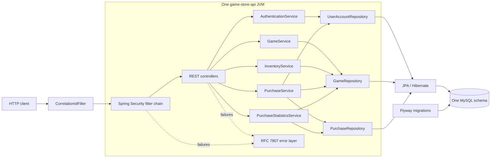
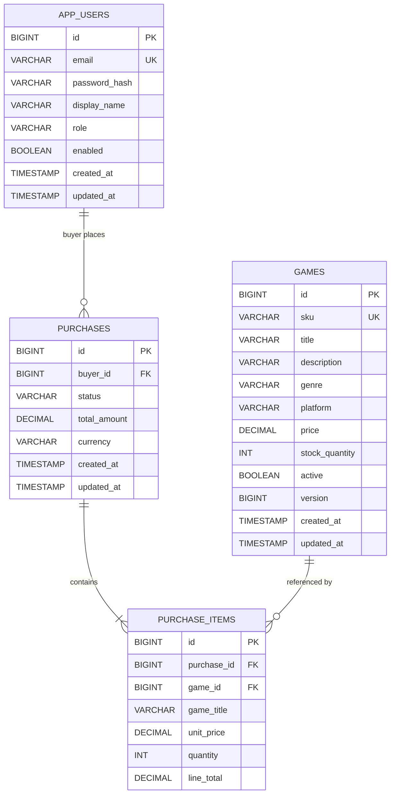
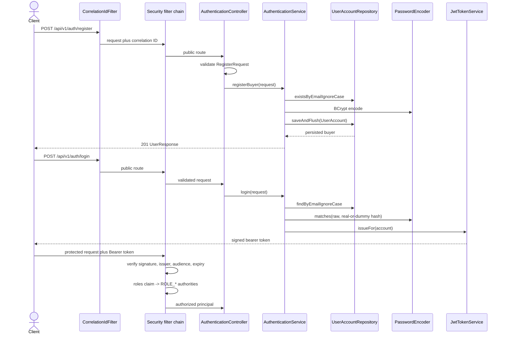
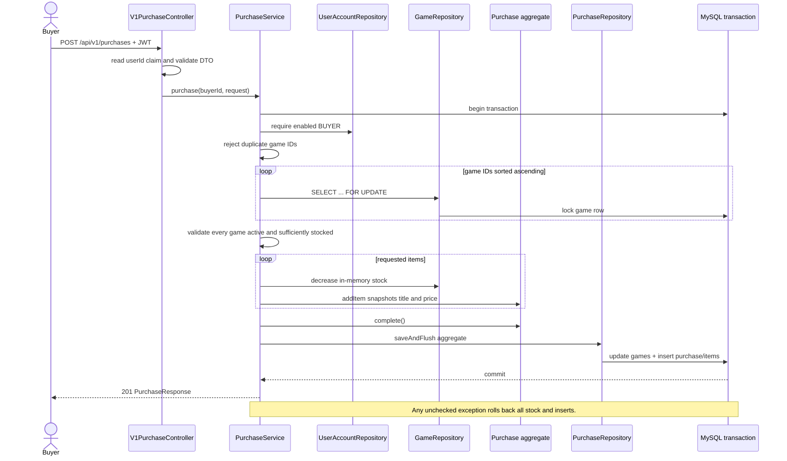
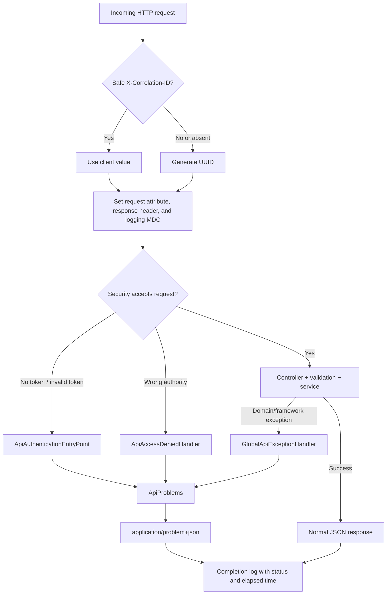

# Game Store: OOP, Architecture, and Runtime Handbook

> Source snapshot reviewed: `C:\Users\Vlad\Documents\GitHub\API-store-management-tool`  
> Handbook scope: 113 physical project files. `.git/**` and generated `target/**` files are intentionally excluded.  
> Safety rule: local secret values are never reproduced in this handbook.

## Table of contents

1. [Executive summary](#1-executive-summary)
2. [System context and technology](#2-system-context-and-technology)
3. [Package and dependency architecture](#3-package-and-dependency-architecture)
4. [Data model](#4-data-model)
5. [OOP principles used](#5-oop-principles-used)
6. [SOLID and design-pattern assessment](#6-solid-and-design-pattern-assessment)
7. [Architectural choices and tradeoffs](#7-architectural-choices-and-tradeoffs)
8. [Complete runtime flows](#8-complete-runtime-flows)
9. [Main Java file reference](#9-main-java-file-reference)
10. [Test file reference](#10-test-file-reference)
11. [Configuration, database, build, and documentation files](#11-configuration-database-build-and-documentation-files)
12. [Tooling and local-file appendix](#12-tooling-and-local-file-appendix)
13. [Coverage checklist](#13-coverage-checklist)
14. [Prioritized design observations](#14-prioritized-design-observations)

## 1. Executive summary

The project is a backend API for an online game shop. Buyers register, authenticate, browse games, purchase stock, and read their own purchase history. Managers authenticate through a bootstrapped account, maintain the game catalog, inspect inventory, and view completed-sales statistics.

The most important architectural fact is:

> **This repository contains one deployable Spring Boot application, not a collection of independently deployed microservices.**

It can reasonably be called a *single microservice* because it is a self-contained HTTP service, but internally it is also a small *modular monolith*: authentication, users, catalog/inventory, purchasing, and reporting run in the same JVM and transaction manager and share one relational schema. Java packages are logical modules, not network service boundaries. There is no HTTP client for another business service, message broker, event bus, service registry, distributed transaction, or separately owned database.

The code uses a feature-oriented package structure over a conventional layered flow:

```text
HTTP request
  -> security/filter infrastructure
  -> controller and request validation
  -> application service and transaction boundary
  -> domain entities plus repository abstraction
  -> JPA/Hibernate
  -> MySQL
```

The strongest design choices are constructor injection, DTO/entity separation, explicit transactional services, domain methods that protect entity invariants, Flyway-owned schema evolution, stateless JWT authorization, consistent RFC 7807 errors, pessimistic checkout locking, historical price snapshots, and a test suite spanning unit, slice, integration, concurrency, and MySQL smoke tests.

The main tradeoffs are that feature boundaries are conventional rather than enforced, services depend directly on Spring Data repositories, multiple packages share entities and tables, controllers contain duplicated legacy routes, the catalog's “active only” story is not completely consistent, and ignored local run configurations contain plaintext credentials.

## 2. System context and technology

### 2.1 Actors and capabilities

| Actor | Authentication | Capabilities |
|---|---|---|
| Anonymous client | None | Register, log in, inspect minimal health, and—outside `prod`—read OpenAPI/Swagger resources |
| Buyer | JWT containing `ROLE_BUYER` | Search/read games, purchase games, read only their own purchase history |
| Manager | JWT containing `ROLE_MANAGER` | Search/read games, create/change/deactivate games, inspect inventory, view purchase statistics |
| Application operator | Environment variables and deployment access | Configure MySQL, JWT signing, manager bootstrap, logging profile, and API-document exposure |

### 2.2 Technology choices

The [Maven descriptor](<C:/Users/Vlad/Documents/GitHub/API-store-management-tool/game-store-api/pom.xml:1>) selects Java 21 and Spring Boot 4.1.0. Its starters reveal the application architecture:

- Spring MVC provides synchronous servlet-based REST controllers.
- Spring Security and OAuth2 Resource Server validate bearer JWTs.
- Spring Data JPA and Hibernate map objects to the relational model.
- Flyway applies versioned SQL migrations and Hibernate validates the result.
- Jakarta Validation checks HTTP DTOs, parameters, entities, and configuration.
- Actuator exposes a deliberately minimal health endpoint.
- springdoc generates OpenAPI and Swagger UI outside production.
- MySQL 8.4 is the production/local database; H2 in MySQL compatibility mode supports the normal test suite.
- JUnit 5, Mockito, MockMvc, full application tests, and a real-MySQL smoke profile cover different test boundaries.

### 2.3 Component map



There are no arrows to other business services because none exist in this version.

## 3. Package and dependency architecture

### 3.1 Package-by-feature with internal layers

| Package | Responsibility | Internal layers |
|---|---|---|
| `auth` | Buyer registration, login, JWT issuing, auth DTOs | Controller, services, request/response records, exceptions |
| `user` | Account entity, role, persistence | Entity, enum, repository |
| `game` | Catalog, manager game lifecycle, inventory | Controllers, services, entity, repository, specifications, projections, DTOs, exceptions |
| `purchase` | Checkout, ownership-scoped history, sales reporting | Controllers, services, aggregate entities, repository queries/projections, DTOs, exceptions |
| `common` | Closed domain-error categories | Shared exception abstraction |
| `config` | Security, JWT properties, OpenAPI, bootstrap properties | Cross-cutting infrastructure |
| `bootstrap` | Idempotent manager creation at startup | Runner and transactional service |
| `error` | Correlation IDs and uniform API errors | Servlet filter, security adapters, exception advice, error DTO/factory |

This is better than a top-level `controller/service/repository` structure for locating a business capability. A developer working on checkout spends most time in `purchase`. The compromise is that the packages are not true modules: public classes and direct cross-package imports allow `purchase` to depend on `game` and `user` internals.

### 3.2 Dependency direction

The intended direction is broadly:

```text
config/bootstrap/error
          |
controllers -> services -> repositories -> entities
                    \------> other feature repositories/entities
DTOs <------------- mapping at controller/service boundaries
```

Controllers depend on services, never repositories. Services own transaction boundaries and depend on repositories. Repositories expose domain entities and query projections. Response records map entities to the public JSON model. JPA entities do not depend on controllers or HTTP classes.

Cross-feature dependencies exist:

- `auth` uses the `user` entity/repository.
- `purchase` uses `user` and `game` entities/repositories.
- `purchase` statistics use both purchase and game repositories.
- global error handling imports feature-specific exceptions.

Those dependencies are acceptable in a small single service, but they mean the feature packages cannot be extracted into independent services by merely deploying each package.

### 3.3 REST surface

| Method and path | Authorization | Controller-to-service flow |
|---|---|---|
| `POST /api/v1/auth/register` | Public | `AuthenticationController -> AuthenticationService.registerBuyer` |
| `POST /api/v1/auth/login` | Public | `AuthenticationController -> AuthenticationService.login -> JwtTokenService` |
| `GET /api/v1/games` | Buyer or manager | `CatalogController -> GameService.searchCatalog` |
| `GET /api/v1/games/{id}` | Buyer or manager | `CatalogController -> GameService.findActiveGame` |
| `POST /api/v1/manager/games` | Manager | `ManagerGameController -> GameService.create` |
| `PATCH /api/v1/manager/games/{id}/price` | Manager | `ManagerGameController -> GameService.changePrice` |
| `PATCH /api/v1/manager/games/{id}/stock` | Manager | `ManagerGameController -> GameService.changeStock` |
| `DELETE /api/v1/manager/games/{id}` | Manager | `ManagerGameController -> GameService.deactivate` |
| `GET /api/v1/manager/inventory` | Manager | `ManagerInventoryController -> InventoryService.inventory` |
| `GET /api/v1/manager/inventory/summary` | Manager | `ManagerInventoryController -> InventoryService.summary` |
| `POST /api/v1/purchases` | Buyer | `V1PurchaseController -> PurchaseService.purchase` |
| `GET /api/v1/purchases/me` | Buyer | `V1PurchaseController -> PurchaseService.history` |
| `GET /api/v1/purchases/{id}` | Buyer and owner | `V1PurchaseController -> PurchaseService.findPurchase` |
| `GET /api/v1/manager/statistics/purchases` | Manager | `ManagerPurchaseStatisticsController -> PurchaseStatisticsService.statistics` |

Catalog and manager operations additionally expose selected unversioned aliases for compatibility. Authentication and purchasing intentionally do not expose equivalent unversioned aliases.

## 4. Data model

### 4.1 Entity relationships



### 4.2 Aggregate and ownership interpretation

`Purchase` is the clearest aggregate root. It owns its `PurchaseItem` collection through cascade and orphan removal, controls item addition and state transitions, and calculates the order total. Callers cannot mutate the internal item list because `getItems()` returns `List.copyOf(...)`. `PurchaseItem` has a package-private business constructor, pushing creation through `Purchase.addItem`.

`Game` is another consistency boundary: price, stock, normalized text, activation state, and version are managed through methods rather than public setters. `UserAccount` similarly controls normalized email, password hash, and enabled state.

The purchase item deliberately contains both a foreign key to the current game and snapshots of `gameTitle` and `unitPrice`. Historical receipts therefore retain the purchased title/price even when the game changes later. The reporting queries aggregate `lineTotal`, not the game's current price.

### 4.3 Schema ownership

Flyway is the schema authority. [V1](<C:/Users/Vlad/Documents/GitHub/API-store-management-tool/game-store-api/src/main/resources/db/migration/V1__create_game_store_schema.sql:1>) creates tables, keys, checks, and initial indexes; [V2](<C:/Users/Vlad/Documents/GitHub/API-store-management-tool/game-store-api/src/main/resources/db/migration/V2__align_v1_contract.sql:1>) evolves the first contract. Hibernate runs with `ddl-auto=validate`, so it checks mappings but is not allowed to silently mutate production schema.

## 5. OOP principles used

### 5.1 Encapsulation

Encapsulation means keeping an object's state behind controlled operations that preserve invariants. It is not merely declaring fields `private`.

Strong examples:

- [Game](<C:/Users/Vlad/Documents/GitHub/API-store-management-tool/game-store-api/src/main/java/com/gamestore/game_store_api/game/Game.java:28>) has private fields and no public setters. `changePrice`, `increaseStock`, `decreaseStock`, `setStockQuantity`, and `deactivate` validate transitions. For example, `decreaseStock` refuses non-positive quantities and overselling.
- [Purchase](<C:/Users/Vlad/Documents/GitHub/API-store-management-tool/game-store-api/src/main/java/com/gamestore/game_store_api/purchase/Purchase.java:36>) controls the `PENDING -> COMPLETED/CANCELLED` state machine. `addItem` rejects inactive games and duplicate games; `complete` rejects empty orders.
- [PurchaseItem](<C:/Users/Vlad/Documents/GitHub/API-store-management-tool/game-store-api/src/main/java/com/gamestore/game_store_api/purchase/PurchaseItem.java:28>) snapshots price/title in its constructor, and outside packages cannot construct arbitrary inconsistent items.
- [UserAccount](<C:/Users/Vlad/Documents/GitHub/API-store-management-tool/game-store-api/src/main/java/com/gamestore/game_store_api/user/UserAccount.java:26>) lowercases and trims email and controls enable/disable operations.
- `CreatePurchaseRequest` defensively copies its incoming list, and response/page records build new immutable lists.

The protected no-argument entity constructors are a JPA requirement, not a breach that allows normal callers to create invalid objects.

### 5.2 Abstraction

Abstraction exposes the behavior a caller needs while hiding implementation detail.

- Controllers ask `GameService` to “search the catalog” rather than building JPA predicates.
- Services ask `GameRepository` or `PurchaseRepository` for domain data rather than writing JDBC.
- Spring Data repository interfaces abstract generated CRUD implementations.
- Projection interfaces such as `InventorySummaryView`, `PurchaseStatisticsView`, and `TopGameSalesView` expose only query-result shapes.
- `SecurityProblemWriter` hides JSON serialization and servlet response details from the two Spring Security failure adapters.
- Response records hide entities and persistence annotations from API clients.

Abstraction is partial at the application boundary: services are concrete classes without use-case interfaces. This is pragmatic for a small service, though it couples controllers to those implementations.

### 5.3 Inheritance

Application-level inheritance is intentionally limited.

- [StoreDomainException](<C:/Users/Vlad/Documents/GitHub/API-store-management-tool/game-store-api/src/main/java/com/gamestore/game_store_api/common/StoreDomainException.java:6>) is a sealed abstract base with four permitted HTTP-semantic categories. Feature exceptions inherit from `BadRequest`, `NotFound`, `Conflict`, or `Forbidden`.
- `CorrelationIdFilter` inherits Spring's `OncePerRequestFilter`.
- `ApiAuthenticationEntryPoint` and `ApiAccessDeniedHandler` implement Spring Security extension interfaces rather than extending a shared application base.
- Repository interfaces extend Spring Data's `JpaRepository`; `GameRepository` also extends `JpaSpecificationExecutor`.

There is no deep entity inheritance hierarchy, which avoids complicated JPA inheritance mapping and fragile “is-a” relationships.

### 5.4 Polymorphism

Polymorphism lets callers work through a contract while runtime behavior comes from a concrete implementation.

- Spring supplies runtime repository implementations for `UserAccountRepository`, `GameRepository`, and `PurchaseRepository`.
- Spring Data supplies proxy implementations of query projection interfaces.
- Spring Security invokes `AuthenticationEntryPoint` and `AccessDeniedHandler` contracts, dispatching to the application's adapters.
- The sealed domain exception hierarchy allows the application to reason about a common error family while retaining feature-specific types.
- `Specification<Game>` values are composed and executed by the JPA criteria implementation.

The project does not showcase subtype polymorphism between multiple business strategies. Most business variation uses data, query composition, or framework interfaces.

### 5.5 Composition over inheritance

The dominant object relationship is composition:

- Controllers contain service references.
- Services contain repository, encoder, clock, or configuration references.
- `Purchase` owns a collection of `PurchaseItem`.
- Security configuration assembles encoders, decoders, converters, handlers, and validators.
- Specifications are combined using `.and(...)`.

This keeps behavior replaceable at wiring/test time and avoids application inheritance trees.

### 5.6 Dependency injection and inversion of control

All main collaborators arrive through constructors. Fields can therefore be `final`, object requirements are visible, and unit tests instantiate services directly with mocks. Spring owns construction and lifecycle through annotations and `@Bean` methods.

This is both:

- **Dependency injection:** collaborators are passed in rather than created internally.
- **Inversion of control:** Spring decides when beans, filters, controllers, and runners are created/called.

`AuthenticationService` does create one derived value internally—the dummy password hash—but the encoder dependency itself is injected.

### 5.7 Immutability, records, and enums

Java records model boundary values: requests, responses, pages, properties, issued tokens, and validation errors. A record makes components final and generates accessors, equality, hash code, and a readable `toString`.

Records are *shallowly* immutable. The code correctly defensively copies `CreatePurchaseRequest.items`; other record components are immutable values or lists created with `stream().toList()`. JPA entities remain mutable because persistence and business transitions require it.

Enums close small state sets:

- `Role` restricts accounts to `BUYER` or `MANAGER`.
- `PurchaseStatus` restricts purchase lifecycle values to `PENDING`, `COMPLETED`, or `CANCELLED`.

Database check constraints duplicate these rules for defense in depth.

### 5.8 Information hiding and API DTO separation

Controllers never return JPA entities. This avoids accidentally serializing password hashes, lazy proxies, bidirectional relationships, internal versioning details not intended for a particular endpoint, or persistence-driven JSON changes.

Static `from(...)` methods colocate mapping with the target response type. This is simple and discoverable. The tradeoff is that response records depend on entity getters; a dedicated mapper layer would reduce that coupling but add ceremony.

### 5.9 Domain invariants versus validation

The code validates at multiple boundaries:

1. Request records reject malformed input before a service call.
2. Services enforce use-case rules involving repositories or multiple aggregates.
3. Entities protect local invariants even when created outside HTTP.
4. Database constraints protect persisted data from all writers.

This duplication is intentional defense in depth. Bean Validation alone is not enough because domain objects can be constructed from tests, bootstrap code, or future non-HTTP adapters.

## 6. SOLID and design-pattern assessment

### 6.1 SOLID

| Principle | Evidence | Assessment and tradeoff |
|---|---|---|
| Single Responsibility | Controllers translate HTTP; services coordinate use cases; repositories persist/query; entities enforce local invariants; error adapters format failures | Generally strong. `GlobalApiExceptionHandler` is large because all exception-to-HTTP mappings are centralized, and `SecurityConfiguration` performs several security-construction duties. |
| Open/Closed | New `Specification<Game>` predicates compose without changing repository code; new repository query projections can be added behind interfaces; new domain exceptions fit category bases | Partial. Adding a feature exception still requires editing the central handler. Sort fields use a closed `switch`, which is desirable input whitelisting even though it is not open-ended. |
| Liskov Substitution | Feature exceptions can be treated as their permitted category/base; Spring Data implementations satisfy repository contracts; security handlers satisfy framework contracts | Sound for the small hierarchies present. There are no complex business subtype hierarchies where LSP is heavily exercised. |
| Interface Segregation | Query projections are tiny and use-case-specific; Spring Security handlers have narrow contracts | Good for projections. Spring Data repositories inherit broad CRUD APIs, and application services expose several use cases from concrete classes rather than narrow ports. |
| Dependency Inversion | Controllers depend on services; services depend on repository interfaces, `PasswordEncoder`, `JwtEncoder`, `Clock`, and properties abstractions | Strong at persistence/framework seams, partial at use-case seams because controllers depend on concrete service classes and entities are shared across features. |

SOLID is a design lens, not a scorecard. For a service of this size, adding an interface for every class would often increase noise without adding a real replacement boundary.

### 6.2 Patterns used

| Pattern | Where | Purpose |
|---|---|---|
| Layered architecture | Controllers, services, repositories, database | Separates HTTP, use-case, persistence, and storage concerns |
| Package by feature | `auth`, `game`, `purchase`, `user` | Keeps related vertical behavior close together |
| Repository | Spring Data repository interfaces | Abstracts persistence and query implementation |
| Service Layer | `AuthenticationService`, `GameService`, `InventoryService`, `PurchaseService`, `PurchaseStatisticsService` | Defines use cases and transaction boundaries |
| DTO | Request/response/page records | Stabilizes API contracts and prevents entity exposure |
| Aggregate Root | `Purchase` controlling `PurchaseItem` | Preserves order/item consistency |
| Specification | `GameSpecifications` | Composes optional catalog filters |
| Projection | Inventory and sales `*View` interfaces | Reads aggregate query results without materializing entities |
| Adapter | Controllers, security handlers, `SecurityProblemWriter` | Adapts HTTP/framework contracts to application behavior |
| Factory Method | Static `from(...)` response mappers and `ApiProblems.create(...)` | Names and centralizes object construction |
| Template Method | `CorrelationIdFilter` overrides `doFilterInternal` from `OncePerRequestFilter` | Inserts custom logic into a framework-managed request algorithm |
| State Machine | `PurchaseStatus` plus `ensurePending()` | Restricts legal purchase transitions |
| Soft Delete | `Game.active` plus `deactivate()` | Preserves historical foreign keys and sales history |
| Optimistic Lock | `Game.version` | Detects conflicting JPA updates |
| Pessimistic Lock | `findByIdForUpdate` during checkout | Serializes stock purchase for the same game |
| Dependency Injection | Constructor injection and `@Bean` methods | Externalizes construction and supports testing |
| Exception Translation | Domain exceptions and global/security handlers | Maps internal failures to stable HTTP problems |
| Configuration Object | `JwtProperties`, `ManagerBootstrapProperties` | Binds related external settings into validated values |

### 6.3 Patterns not present

The code does not implement distributed Saga, CQRS infrastructure, event sourcing, API gateway, circuit breaker, service discovery, asynchronous messaging, outbox, cache-aside, payment adapter, or hexagonal ports for every use case. Those should not be inferred merely because the application is called a microservice.

There is a mild read/write separation in DTOs and aggregate projections, but it is not full CQRS: reads and writes share the same service, repository technology, database, and model.

## 7. Architectural choices and tradeoffs

### 7.1 One deployable and one database

**Choice:** keep all capabilities in one Spring Boot process and one schema.

**Benefits:** local transactions make stock deduction and purchase creation atomic; no distributed consistency problem; straightforward deployment, debugging, and tests; foreign keys enforce integrity.

**Costs:** features scale and deploy together; a schema change can affect several packages; purchase/auth/catalog cannot fail or evolve independently; extracting a service later requires redefining data ownership and replacing direct entity/repository calls with contracts.

### 7.2 Synchronous REST

Controllers use request/response HTTP with JSON. This matches interactive catalog and checkout use cases. There are no asynchronous jobs or events. Long-running payment or fulfillment workflows are not part of V1, so synchronous processing is adequate.

### 7.3 Stateless JWT security

[SecurityConfiguration](<C:/Users/Vlad/Documents/GitHub/API-store-management-tool/game-store-api/src/main/java/com/gamestore/game_store_api/config/SecurityConfiguration.java:38>) disables CSRF, request cache, HTTP Basic, form login, logout, and server sessions. A signed HS256 token carries subject, user ID, and roles. The decoder validates signature, issuer, expiry/default claims, and audience; a converter maps the custom `roles` claim to `ROLE_*` authorities.

Benefits are horizontal statelessness and simple bearer use. Costs are no refresh token, revocation, key rotation protocol, or immediate role/disable propagation to already issued tokens. Purchase services re-check the account's enabled/role state, but catalog and manager endpoints rely on token claims until expiration.

### 7.4 Authorization in two layers

URL rules in the filter chain provide coarse access control. `@PreAuthorize` on controllers provides method-level defense and documents intent. The duplication is deliberate defense in depth, but route and annotation policies must stay aligned.

Buyer ownership is enforced in the repository query itself (`purchase.id` and `buyer.id`), not just in the URL layer. Returning “not found” for another buyer's purchase avoids confirming that the purchase exists.

### 7.5 DTOs and validation

HTTP records carry Jakarta Validation annotations, while controllers add validation for path/query values. Services validate cross-field and cross-entity rules. Entities enforce local invariants. The global handler converts all validation sources into one problem shape.

This produces duplicated checks at intentional trust boundaries. The main maintenance risk is inconsistent limits between request annotations, entity annotations, configuration validation, and SQL checks.

### 7.6 Transactional service layer

Writing use cases carry `@Transactional`; query use cases use `@Transactional(readOnly = true)`. This keeps lazy loading and dirty checking inside a controlled boundary and makes `spring.jpa.open-in-view=false` safe.

The code frequently calls `flush()`/`saveAndFlush()` so database uniqueness/version errors occur inside the use case and can be translated. This improves error timing but can add round trips.

### 7.7 Concurrency model

Two strategies coexist:

- `Game.version` provides optimistic detection for ordinary concurrent changes.
- Checkout uses `PESSIMISTIC_WRITE` locks because inventory is a hot invariant that must not oversell.

Checkout sorts requested game IDs before taking locks. Concurrent multi-game purchases therefore acquire rows in a consistent order, reducing deadlock risk. All availability checks happen before any stock mutation; if a later step throws, the surrounding transaction rolls everything back.

### 7.8 Persistence and migrations

JPA supplies object mapping and generated repository implementations; Flyway owns DDL. MySQL constraints duplicate important invariants. Lazy `ManyToOne` associations reduce unnecessary loading, while the detailed-purchase query explicitly fetches items and games to produce one receipt safely inside the transaction.

The application depends on MySQL behavior but runs normal tests on H2 compatibility mode. The separate MySQL smoke test reduces—but does not eliminate—dialect drift risk.

### 7.9 Soft deletion and historical truth

Games are deactivated, not deleted. Purchase items retain foreign keys, names, and prices. This preserves referential integrity and historical receipts.

The catalog search API deserves care: `findById` explicitly requires `active=true`, but the general specification only filters activity when the caller supplies the `active` parameter. That means an omitted activity filter can include inactive games even though README language calls this an “active catalog.” This should be treated as a current behavioral/documentation inconsistency, not silently explained away.

### 7.10 Read models and database aggregation

Inventory and sales summaries are computed in JPQL and returned through projection interfaces. Aggregating in the database avoids loading every purchase/item into Java. Response records then add derived values such as average order value and low-stock threshold.

The read model remains strongly coupled to entity property names and JPQL. A database view or dedicated query adapter would provide a firmer boundary if reporting becomes complex.

### 7.11 API versioning and compatibility aliases

V1 routes are canonical. Some controllers declare arrays containing V1 and legacy paths. This is a low-cost migration mechanism, but it doubles the routable surface and security/test burden. OpenAPI is expected to highlight V1, while legacy aliases are temporary.

### 7.12 Errors and observability

Errors use `ProblemDetail` (`application/problem+json`) with stable `code`, timestamp, instance, and correlation ID; validation errors add field details. A highest-precedence filter accepts only safe correlation IDs, generates a UUID otherwise, adds it to the response and logging MDC, and logs completion time.

Framework security failures occur before controllers, so dedicated entry-point/access-denied adapters use the same problem factory/writer as controller advice. This is a good example of one external contract implemented across different framework paths.

### 7.13 Configuration profiles

The default profile reads secrets from environment variables or an optional local `.env`. `debug` adds diagnostic logging while keeping request details and SQL bind values disabled. `prod` disables OpenAPI/Swagger. `test` uses an isolated H2 database and safe test-only configuration.

### 7.14 Operational choices

Docker Compose provisions only MySQL; the application runs from Maven/IDE rather than as a container. Actuator exposes health only and hides details. CI runs a normal H2-backed verification job plus a real-MySQL end-to-end job. There is no production container manifest, deployment manifest, metrics export, tracing backend, or secret manager in this repository.

## 8. Complete runtime flows

### 8.1 Startup and manager bootstrap

1. `GameStoreApiApplication` starts Spring component scanning and configuration-property scanning.
2. Spring loads external properties, creates the data source, and Flyway applies pending migrations.
3. Hibernate validates that entities match the migrated schema.
4. `SecurityConfiguration` constructs password, JWT, authorization, and clock beans.
5. Spring Data creates runtime repository proxies.
6. `ManagerBootstrapRunner` is called after startup.
7. `ManagerBootstrapService.bootstrap()` starts a transaction and looks up the configured manager email.
8. If a manager already exists, it exits idempotently. If the email belongs to a buyer, startup fails rather than escalating that account. Otherwise it validates the configured password length, BCrypt-hashes it, and inserts a `MANAGER`.

### 8.2 Registration, login, and authorization



Using a dummy BCrypt hash for unknown emails makes the failure path perform password work similar to a known account, reducing username-enumeration timing signals. Registration checks for duplicate email before insert for friendly behavior and catches the database uniqueness race after `saveAndFlush`.

### 8.3 Catalog search and game lookup

1. Security requires a buyer or manager role.
2. Controller annotations validate pagination, prices, text lengths, and path ID.
3. `GameService` validates min/max price and maps a small whitelist of public sort names to entity properties.
4. `GameSpecifications.catalog` composes optional text, genre, platform, price, and active predicates.
5. Spring Data executes the specification with stable secondary sort by ID and pagination.
6. `GameCatalogPage.from` maps entities to `GameResponse`; the controller returns no JPA entity.
7. Single-game lookup uses `findByIdAndActiveTrue`, so inactive games appear as 404.

### 8.4 Manager game lifecycle

**Create:** pre-check case-insensitive SKU, normalize/default fields through `Game`, insert and flush, catch a database duplicate race, return `201` with a canonical V1 `Location`.

**Price change:** load the managed entity, reject inactive games, call `Game.changePrice`, flush, return a DTO.

**Stock change:** accept either canonical absolute `stockQuantity` or legacy nonzero `delta`, require exactly one, prevent negative/overflow results, change the entity, and flush.

**Deactivate:** load the game, set `active=false` only if needed, and return `204`. Repeated deactivation is idempotent. The row is retained.

### 8.5 Inventory reporting

The manager inventory list searches both active and inactive games and maps each row to a derived view containing low-stock status and `price * stock`. The summary query calculates active counts, units, empty/low-stock counts, and total active inventory value in the database; a separate count adds inactive games.

The inventory-summary query excludes zero-stock games from its “low stock” count because it reports them separately as “out of stock.” The per-game `lowStock` flag uses `stock <= threshold`, so it marks zero as low. Consumers should understand this deliberate but slightly different semantic.

### 8.6 Atomic checkout



The transaction and row locks are the core microservice business logic: two buyers cannot both consume the final unit. Lock ordering reduces multi-row deadlocks. No stock is changed until every requested line is validated. Purchase-item price/title snapshots preserve historical truth.

### 8.7 Purchase history and ownership

The controller extracts `userId` from the verified JWT. The service re-loads that account and requires enabled `BUYER`, then:

- lists purchases by `buyerId`, newest first, as summaries; or
- fetches a detailed purchase with `purchaseId AND buyerId`, eagerly loading items/games.

A buyer asking for another buyer's purchase receives 404 because the ownership-scoped query returns empty. Managers are rejected by both URL/method security and the service's active-buyer check.

### 8.8 Sales statistics

1. Controller validates limits and parses optional ISO dates.
2. Service rejects `from > to`.
3. Inclusive `to` becomes the next day's midnight exclusive bound, avoiding end-of-day precision mistakes.
4. Repository projections aggregate completed purchase count, revenue, unique buyers, units, and top games using historical line totals.
5. A game-repository count supplies current low-stock information.
6. Service computes average order value with two-decimal half-up rounding and returns EUR as V1's fixed currency.

This response mixes historical sales facts with current inventory state. That is useful for a manager dashboard but should be documented because the date range applies to sales, not the low-stock count.

### 8.9 Correlation IDs and error flow



Validation has several Spring exception shapes—request-body binding, method validation, constraint violations, missing parameters, type mismatch, malformed JSON—and the advice normalizes them. Domain exceptions receive stable public codes. Optimistic lock failure becomes `409`. Unknown exceptions are logged server-side and return a generic `500` detail.

### 8.10 Persistence lifecycle

For a write request, the service transaction loads managed entities. Domain methods modify them. Hibernate dirty checking emits updates at flush/commit; aggregate cascade inserts purchase items. Flyway and database constraints ensure the schema and persisted invariants remain valid. With Open Session in View disabled, response mapping must occur before the transaction closes when lazy relationships are needed.

## 9. Main Java file reference

This section covers all 74 production Java files. “OOP” describes principles genuinely present in the file; infrastructure records and marker exceptions are not credited with business behavior they do not contain.

### 9.1 Application entry point

#### [`game-store-api/src/main/java/com/gamestore/game_store_api/GameStoreApiApplication.java`](<C:/Users/Vlad/Documents/GitHub/API-store-management-tool/game-store-api/src/main/java/com/gamestore/game_store_api/GameStoreApiApplication.java:1>)

- **Role and flow:** Defines `main`, delegates process startup to `SpringApplication.run`, and enables scanning of immutable `@ConfigurationProperties` records. It is the composition-root entry point consumed by the JVM, Maven, IDE run configurations, and all `@SpringBootTest` contexts.
- **OOP and architecture:** Demonstrates inversion of control rather than business OOP: Spring discovers and constructs the graph below this root. `@SpringBootApplication` combines configuration, component scanning, and auto-configuration.
- **Assessment:** Correctly contains no business logic. Keeping the root package above every feature makes component/repository/entity scanning predictable.

### 9.2 Authentication package

#### [`game-store-api/src/main/java/com/gamestore/game_store_api/auth/AuthenticationController.java`](<C:/Users/Vlad/Documents/GitHub/API-store-management-tool/game-store-api/src/main/java/com/gamestore/game_store_api/auth/AuthenticationController.java:1>)

- **Role and flow:** Exposes the two public V1 endpoints. Validated `RegisterRequest` and `LoginRequest` values go to `AuthenticationService`; results are mapped to `UserResponse` or `TokenResponse`. OpenAPI annotations document success and public failure cases.
- **OOP and architecture:** Constructor injection expresses its only dependency. It is an HTTP adapter and thin-controller example: protocol concerns stay here while password and persistence rules stay in the service/entity.
- **Assessment:** The controller never returns `UserAccount`, preventing password-hash leakage. It deliberately has no unversioned alias, unlike temporary catalog/manager compatibility endpoints.

#### [`game-store-api/src/main/java/com/gamestore/game_store_api/auth/AuthenticationService.java`](<C:/Users/Vlad/Documents/GitHub/API-store-management-tool/game-store-api/src/main/java/com/gamestore/game_store_api/auth/AuthenticationService.java:18>)

- **Role and flow:** Registers buyers transactionally, applies the BCrypt byte limit, checks/catches duplicate email, encodes passwords, and persists a `UserAccount`. Login reads an account, performs a real-or-dummy password comparison, rejects disabled/invalid accounts uniformly, and delegates JWT creation.
- **OOP and architecture:** A Service Layer object composes repository, encoder, and token-service abstractions through constructor injection. It delegates email/name invariants to `UserAccount` and token mechanics to `JwtTokenService`.
- **Assessment:** The dummy hash reduces timing-based account discovery, and catching the insert race complements the friendly existence check. Catching any `DataIntegrityViolationException` as duplicate email could mislabel a future unrelated database constraint; narrower constraint translation would scale better.

#### [`game-store-api/src/main/java/com/gamestore/game_store_api/auth/EmailAlreadyRegisteredException.java`](<C:/Users/Vlad/Documents/GitHub/API-store-management-tool/game-store-api/src/main/java/com/gamestore/game_store_api/auth/EmailAlreadyRegisteredException.java:1>)

- **Role and flow:** Represents the registration uniqueness conflict and supplies a safe public detail. `AuthenticationService` throws it; `GlobalApiExceptionHandler` maps it to HTTP 409 and `email_already_registered`.
- **OOP and architecture:** Uses inheritance to specialize the non-sealed `StoreDomainException.Conflict` category.
- **Assessment:** The dedicated type makes service code and tests expressive. It contains no behavior beyond error classification, which is appropriate.

#### [`game-store-api/src/main/java/com/gamestore/game_store_api/auth/InvalidPasswordException.java`](<C:/Users/Vlad/Documents/GitHub/API-store-management-tool/game-store-api/src/main/java/com/gamestore/game_store_api/auth/InvalidPasswordException.java:1>)

- **Role and flow:** Carries a password-policy failure discovered beyond annotation validation—currently the BCrypt 72 UTF-8 byte restriction. The global handler returns HTTP 400 with `invalid_password`.
- **OOP and architecture:** Specializes the common `BadRequest` abstraction while preserving a feature-specific catch type.
- **Assessment:** Separating byte length from character-count validation is correct for multibyte input. The public message reveals policy, not credentials.

#### [`game-store-api/src/main/java/com/gamestore/game_store_api/auth/IssuedToken.java`](<C:/Users/Vlad/Documents/GitHub/API-store-management-tool/game-store-api/src/main/java/com/gamestore/game_store_api/auth/IssuedToken.java:1>)

- **Role and flow:** Internal immutable value returned by `JwtTokenService` and consumed by `AuthenticationService`/`TokenResponse`. It groups token text, absolute expiry, and relative expiry seconds.
- **OOP and architecture:** A record is a value-object/DTO abstraction with generated accessors and structural equality.
- **Assessment:** It prevents the token service from depending on the public HTTP response shape. It contains sensitive token material, so logging its generated `toString()` would be unsafe even though the current code does not do so.

#### [`game-store-api/src/main/java/com/gamestore/game_store_api/auth/JwtTokenService.java`](<C:/Users/Vlad/Documents/GitHub/API-store-management-tool/game-store-api/src/main/java/com/gamestore/game_store_api/auth/JwtTokenService.java:17>)

- **Role and flow:** Uses an injected `JwtEncoder`, validated `JwtProperties`, and UTC `Clock` to issue HS256 tokens with issuer, audience, subject, `userId`, roles, issued-at, and expiry claims.
- **OOP and architecture:** Encapsulates token construction behind the intention-revealing `issueFor(UserAccount)` operation. Injecting `Clock` is dependency inversion and makes time replaceable in focused tests.
- **Assessment:** Centralizing claims avoids controller duplication. V1 has no `jti`, refresh token, revocation, or rotation scheme; those are explicit product limitations, not hidden framework capabilities.

#### [`game-store-api/src/main/java/com/gamestore/game_store_api/auth/LoginRequest.java`](<C:/Users/Vlad/Documents/GitHub/API-store-management-tool/game-store-api/src/main/java/com/gamestore/game_store_api/auth/LoginRequest.java:1>)

- **Role and flow:** Immutable request DTO for email/password login. Bean Validation rejects blank/invalid/oversized values before the service.
- **OOP and architecture:** Record-based boundary value with declarative validation; it has no business behavior.
- **Assessment:** The password maximum is intentionally more permissive than the registration character maximum because login should safely process input before the encoder comparison. The service still owns authentication semantics.

#### [`game-store-api/src/main/java/com/gamestore/game_store_api/auth/RegisterRequest.java`](<C:/Users/Vlad/Documents/GitHub/API-store-management-tool/game-store-api/src/main/java/com/gamestore/game_store_api/auth/RegisterRequest.java:1>)

- **Role and flow:** Defines registration fields and character-level policy: email syntax/length, optional display-name length, password length, at least one Unicode letter, at least one punctuation/symbol, and no line breaks.
- **OOP and architecture:** An immutable command DTO. Annotations are metadata interpreted polymorphically by the Jakarta Validation provider; the record itself is not the validator.
- **Assessment:** HTTP validation improves feedback, while `AuthenticationService` and `UserAccount` still protect non-HTTP construction. Character count and BCrypt byte count are correctly treated as different rules.

#### [`game-store-api/src/main/java/com/gamestore/game_store_api/auth/TokenResponse.java`](<C:/Users/Vlad/Documents/GitHub/API-store-management-tool/game-store-api/src/main/java/com/gamestore/game_store_api/auth/TokenResponse.java:1>)

- **Role and flow:** Public login response with bearer type, access token, relative expiry, and absolute expiry. Its package-private `from(IssuedToken)` factory performs the internal-to-public mapping.
- **OOP and architecture:** Immutable DTO plus named factory method. It separates the token issuer's internal value from the wire contract.
- **Assessment:** The mapping is small enough to live with the DTO. As with `IssuedToken`, generated record text must never be logged.

#### [`game-store-api/src/main/java/com/gamestore/game_store_api/auth/UserResponse.java`](<C:/Users/Vlad/Documents/GitHub/API-store-management-tool/game-store-api/src/main/java/com/gamestore/game_store_api/auth/UserResponse.java:1>)

- **Role and flow:** Public registration result containing safe account data only. `from(UserAccount)` copies ID, normalized email, display name, role, and creation time.
- **OOP and architecture:** DTO/entity separation and static factory mapping.
- **Assessment:** Excluding `passwordHash`, `enabled`, and update timestamp demonstrates information hiding. The record depends on the domain entity for mapping, a reasonable small-project coupling.

### 9.3 User package

#### [`game-store-api/src/main/java/com/gamestore/game_store_api/user/Role.java`](<C:/Users/Vlad/Documents/GitHub/API-store-management-tool/game-store-api/src/main/java/com/gamestore/game_store_api/user/Role.java:1>)

- **Role and flow:** Closed account-role vocabulary shared by persistence, JWT claims, bootstrap, purchase rules, and security configuration.
- **OOP and architecture:** Enum-based type safety replaces error-prone role strings inside application code.
- **Assessment:** Database checks and `EnumType.STRING` preserve readable values and avoid ordinal migration hazards. Adding a role would require coordinated security, migration, and behavior changes.

#### [`game-store-api/src/main/java/com/gamestore/game_store_api/user/UserAccount.java`](<C:/Users/Vlad/Documents/GitHub/API-store-management-tool/game-store-api/src/main/java/com/gamestore/game_store_api/user/UserAccount.java:26>)

- **Role and flow:** JPA entity for `app_users`. Constructors normalize email, require a password hash/name/role, and derive a default display name. Methods change the hash or enabled state; Hibernate supplies identity and timestamps.
- **OOP and architecture:** Strong encapsulation through private state and invariant-preserving methods; constructor overloading delegates to one full constructor. It is shared by auth, bootstrap, and purchase.
- **Assessment:** Email normalization at construction gives repository and database consistency. `changePasswordHash`, `disable`, and `enable` are currently unused V1 capabilities. Role is immutable after construction, which prevents accidental privilege escalation.

#### [`game-store-api/src/main/java/com/gamestore/game_store_api/user/UserAccountRepository.java`](<C:/Users/Vlad/Documents/GitHub/API-store-management-tool/game-store-api/src/main/java/com/gamestore/game_store_api/user/UserAccountRepository.java:1>)

- **Role and flow:** Persistence abstraction with generated CRUD plus case-insensitive lookup/existence methods used by auth and bootstrap; purchase uses inherited `findById`.
- **OOP and architecture:** Interface abstraction and runtime polymorphism: Spring Data generates the implementation from method names.
- **Assessment:** Compact and intention revealing. Because it exposes the JPA entity and broad CRUD API, it is a persistence interface rather than a domain-owned hexagonal port.

### 9.4 Common domain error package

#### [`game-store-api/src/main/java/com/gamestore/game_store_api/common/StoreDomainException.java`](<C:/Users/Vlad/Documents/GitHub/API-store-management-tool/game-store-api/src/main/java/com/gamestore/game_store_api/common/StoreDomainException.java:6>)

- **Role and flow:** Defines the closed top-level family of domain failures and the four allowed semantic categories: bad request, not found, conflict, and forbidden. Feature exceptions inherit from a non-sealed category.
- **OOP and architecture:** The clearest explicit inheritance design. `sealed` restricts direct root subclasses, while `non-sealed` categories allow feature specialization. This is controlled extensibility.
- **Assessment:** It documents semantics centrally, but the HTTP handler currently maps concrete exceptions one by one rather than exploiting the categories generically. That preserves stable feature codes at the cost of handler growth.

### 9.5 Configuration package

#### [`game-store-api/src/main/java/com/gamestore/game_store_api/config/JwtProperties.java`](<C:/Users/Vlad/Documents/GitHub/API-store-management-tool/game-store-api/src/main/java/com/gamestore/game_store_api/config/JwtProperties.java:8>)

- **Role and flow:** Binds `app.security.jwt.*` settings and fails startup for blank secret/issuer/audience or non-positive TTL. Security and token services consume it.
- **OOP and architecture:** Immutable configuration value with a compact canonical constructor enforcing object validity.
- **Assessment:** Fail-fast configuration is safer than discovering a missing key on the first request. Base64 validity and decoded key length are checked later when the `SecretKey` bean is created, splitting related validation across two files.

#### [`game-store-api/src/main/java/com/gamestore/game_store_api/config/ManagerBootstrapProperties.java`](<C:/Users/Vlad/Documents/GitHub/API-store-management-tool/game-store-api/src/main/java/com/gamestore/game_store_api/config/ManagerBootstrapProperties.java:1>)

- **Role and flow:** Binds manager email/password used only for startup bootstrap and login tests; rejects blanks during context creation.
- **OOP and architecture:** Immutable configuration object, scanned by the application root.
- **Assessment:** Password length is checked in `ManagerBootstrapService`, not here. Keeping the raw password in a long-lived bean is convenient but increases secret lifetime in memory; a production secret integration could narrow exposure.

#### [`game-store-api/src/main/java/com/gamestore/game_store_api/config/OpenApiConfiguration.java`](<C:/Users/Vlad/Documents/GitHub/API-store-management-tool/game-store-api/src/main/java/com/gamestore/game_store_api/config/OpenApiConfiguration.java:1>)

- **Role and flow:** Supplies API metadata, tag descriptions, and the shared JWT bearer scheme name consumed by controller annotations and springdoc.
- **OOP and architecture:** Cross-cutting configuration; `BEARER_AUTH` removes duplicated string literals. `proxyBeanMethods=false` avoids unnecessary configuration-class proxying because no inter-bean calls exist.
- **Assessment:** This file describes contracts but contains no business OOP. Production properties disable generated documentation without changing controllers.

#### [`game-store-api/src/main/java/com/gamestore/game_store_api/config/SecurityConfiguration.java`](<C:/Users/Vlad/Documents/GitHub/API-store-management-tool/game-store-api/src/main/java/com/gamestore/game_store_api/config/SecurityConfiguration.java:38>)

- **Role and flow:** Builds the stateless authorization chain, BCrypt encoder, HS256 key/encoder/decoder, issuer/audience validators, role converter, and UTC clock. It connects custom 401/403 writers to both general and resource-server failures.
- **OOP and architecture:** Composition root for security objects; framework interfaces and injected handlers demonstrate polymorphism and dependency inversion. The fluent DSL builds a configured filter-chain object.
- **Assessment:** It validates decoded secret length and whitelists public paths. URL rules duplicate controller `@PreAuthorize` intentionally. Symmetric HS256 means every verifier holding the key could also issue tokens; asymmetric keys would separate those powers in a larger system.

### 9.6 Bootstrap package

#### [`game-store-api/src/main/java/com/gamestore/game_store_api/bootstrap/ManagerBootstrapRunner.java`](<C:/Users/Vlad/Documents/GitHub/API-store-management-tool/game-store-api/src/main/java/com/gamestore/game_store_api/bootstrap/ManagerBootstrapRunner.java:1>)

- **Role and flow:** Spring calls `run` after application startup; it delegates immediately to the transactional bootstrap service.
- **OOP and architecture:** Implements the framework's `ApplicationRunner` interface, an example of polymorphic callback/adaptation. Constructor injection supplies the use case.
- **Assessment:** Keeping transaction logic out of the runner matters because self-invocation or lifecycle timing can otherwise bypass proxies. The runner correctly remains thin.

#### [`game-store-api/src/main/java/com/gamestore/game_store_api/bootstrap/ManagerBootstrapService.java`](<C:/Users/Vlad/Documents/GitHub/API-store-management-tool/game-store-api/src/main/java/com/gamestore/game_store_api/bootstrap/ManagerBootstrapService.java:1>)

- **Role and flow:** Idempotently creates the configured manager. Existing managers are left unchanged; an existing buyer with the same email stops startup; new managers receive a BCrypt hash and fixed display name.
- **OOP and architecture:** Transactional Service Layer composing repository, encoder, and configuration. It constructs a valid `UserAccount` rather than mutating role after creation.
- **Assessment:** Safe against accidental buyer promotion. Simultaneous startup of multiple replicas can still race on the unique email because this service does not catch the insert conflict; deployment normally starts replicas concurrently, so explicit handling would improve robustness.

### 9.7 Error and observability package

#### [`game-store-api/src/main/java/com/gamestore/game_store_api/error/ApiAccessDeniedHandler.java`](<C:/Users/Vlad/Documents/GitHub/API-store-management-tool/game-store-api/src/main/java/com/gamestore/game_store_api/error/ApiAccessDeniedHandler.java:1>)

- **Role and flow:** Handles authenticated users lacking authority before MVC advice can act. It creates a stable 403 problem and delegates serialization to `SecurityProblemWriter`.
- **OOP and architecture:** Adapter implementing Spring Security's `AccessDeniedHandler`; runtime dispatch is interface polymorphism.
- **Assessment:** Sharing the factory/writer keeps security and controller errors consistent. The declared `ServletException` is required by the framework signature rather than used by its body.

#### [`game-store-api/src/main/java/com/gamestore/game_store_api/error/ApiAuthenticationEntryPoint.java`](<C:/Users/Vlad/Documents/GitHub/API-store-management-tool/game-store-api/src/main/java/com/gamestore/game_store_api/error/ApiAuthenticationEntryPoint.java:1>)

- **Role and flow:** Handles missing or invalid authentication and produces the stable 401 `authentication_required` problem before controller execution.
- **OOP and architecture:** Implements the framework `AuthenticationEntryPoint` contract and composes `SecurityProblemWriter`.
- **Assessment:** It intentionally does not expose token-verification details, preventing information leakage and maintaining one public response for several authentication failures.

#### [`game-store-api/src/main/java/com/gamestore/game_store_api/error/ApiProblems.java`](<C:/Users/Vlad/Documents/GitHub/API-store-management-tool/game-store-api/src/main/java/com/gamestore/game_store_api/error/ApiProblems.java:1>)

- **Role and flow:** Static factory for normal and validation `ProblemDetail` objects. It assigns a URN type, status/title/detail, request instance, public code, timestamp, and correlation ID.
- **OOP and architecture:** Factory-method pattern in a non-instantiable utility class. It centralizes the wire contract across advice and security adapters.
- **Assessment:** Excellent contract consistency. It calls `Instant.now()` directly while JWT code injects `Clock`; injecting time would make timestamp tests deterministic and align the design.

#### [`game-store-api/src/main/java/com/gamestore/game_store_api/error/ApiValidationError.java`](<C:/Users/Vlad/Documents/GitHub/API-store-management-tool/game-store-api/src/main/java/com/gamestore/game_store_api/error/ApiValidationError.java:1>)

- **Role and flow:** Immutable field/message pair embedded in validation problems.
- **OOP and architecture:** Minimal response value object; no business logic.
- **Assessment:** The intentionally generic message structure works across body, query, path, and method validation.

#### [`game-store-api/src/main/java/com/gamestore/game_store_api/error/CorrelationIdFilter.java`](<C:/Users/Vlad/Documents/GitHub/API-store-management-tool/game-store-api/src/main/java/com/gamestore/game_store_api/error/CorrelationIdFilter.java:32>)

- **Role and flow:** Runs once at highest precedence, validates or generates an ID, writes request/response context, scopes SLF4J MDC, invokes the remaining chain, and logs status plus latency in `finally`.
- **OOP and architecture:** Template Method pattern through `OncePerRequestFilter`; overrides one step in the framework lifecycle. Constants form the shared contract read by `ApiProblems`.
- **Assessment:** The strict 64-character safe pattern prevents log injection. `finally` records failures too. In distributed deployments it preserves a valid incoming ID but does not implement trace/span propagation standards.

#### [`game-store-api/src/main/java/com/gamestore/game_store_api/error/GlobalApiExceptionHandler.java`](<C:/Users/Vlad/Documents/GitHub/API-store-management-tool/game-store-api/src/main/java/com/gamestore/game_store_api/error/GlobalApiExceptionHandler.java:1>)

- **Role and flow:** Normalizes body/method/constraint/type/JSON errors, auth failures reaching MVC, every feature exception, optimistic conflicts, missing resources, unsupported methods/media, and unexpected exceptions into stable problems.
- **OOP and architecture:** Central exception-translation adapter separates domain/service exceptions from HTTP status and JSON. Overloaded handlers provide type-based framework dispatch.
- **Assessment:** Comprehensive and backed by integration tests, but it is the largest cross-feature coupling point: each new public error usually adds an import and method. The generic final handler correctly logs the real exception and returns a safe detail.

#### [`game-store-api/src/main/java/com/gamestore/game_store_api/error/SecurityProblemWriter.java`](<C:/Users/Vlad/Documents/GitHub/API-store-management-tool/game-store-api/src/main/java/com/gamestore/game_store_api/error/SecurityProblemWriter.java:1>)

- **Role and flow:** Converts a `ProblemDetail` into status, `application/problem+json`, and a serialized servlet response for security failures.
- **OOP and architecture:** Small adapter around injected `ObjectMapper`, reused by two different security callbacks.
- **Assessment:** Removes duplicate serialization code. It writes directly because controller response conversion is not active on those filter-chain failure paths.

### 9.8 Game and inventory package

#### [`game-store-api/src/main/java/com/gamestore/game_store_api/game/CatalogController.java`](<C:/Users/Vlad/Documents/GitHub/API-store-management-tool/game-store-api/src/main/java/com/gamestore/game_store_api/game/CatalogController.java:1>)

- **Role and flow:** Serves paged/filterable game search and active-by-ID lookup on V1 and legacy catalog paths. Query/path constraints run before `GameService`; buyer and manager authorization is declared at class level.
- **OOP and architecture:** Thin REST adapter with constructor-injected service and immutable outputs. OpenAPI metadata documents parameter semantics.
- **Assessment:** The optional `active` parameter can expose inactive rows to buyers when omitted or set false, while class/README text describes an active catalog. That behavior/documentation/security decision should be resolved explicitly.

#### [`game-store-api/src/main/java/com/gamestore/game_store_api/game/ChangePriceRequest.java`](<C:/Users/Vlad/Documents/GitHub/API-store-management-tool/game-store-api/src/main/java/com/gamestore/game_store_api/game/ChangePriceRequest.java:1>)

- **Role and flow:** Immutable command for replacing price; requires non-null, at least EUR 0.01, and database-compatible precision/scale.
- **OOP and architecture:** Request DTO with declarative boundary validation.
- **Assessment:** `Game.changePrice` repeats the core positive/two-decimal invariant for non-HTTP callers, which is appropriate defense in depth.

#### [`game-store-api/src/main/java/com/gamestore/game_store_api/game/ChangeStockRequest.java`](<C:/Users/Vlad/Documents/GitHub/API-store-management-tool/game-store-api/src/main/java/com/gamestore/game_store_api/game/ChangeStockRequest.java:1>)

- **Role and flow:** Carries canonical absolute `stockQuantity` or legacy `delta`; its cross-field `@AssertTrue` requires exactly one and rejects zero delta. A convenience constructor supports absolute updates.
- **OOP and architecture:** Record with behavior, showing that DTOs can own shape-level invariants rather than being passive bags.
- **Assessment:** Compatibility logic leaks into the V1 DTO/service and complicates the advertised absolute-update contract. Removing `delta` after migration would simplify code and error semantics.

#### [`game-store-api/src/main/java/com/gamestore/game_store_api/game/CreateGameRequest.java`](<C:/Users/Vlad/Documents/GitHub/API-store-management-tool/game-store-api/src/main/java/com/gamestore/game_store_api/game/CreateGameRequest.java:1>)

- **Role and flow:** Validates game creation fields and provides an older convenience constructor that fills genre/platform defaults.
- **OOP and architecture:** Immutable command DTO; constructor delegation supports compatibility while keeping one canonical record state.
- **Assessment:** The DTO permits blank genre/platform because only `@Size` is present; `GameService` converts null/blank to defaults before the entity enforces nonblank values.

#### [`game-store-api/src/main/java/com/gamestore/game_store_api/game/DuplicateGameSkuException.java`](<C:/Users/Vlad/Documents/GitHub/API-store-management-tool/game-store-api/src/main/java/com/gamestore/game_store_api/game/DuplicateGameSkuException.java:1>)

- **Role and flow:** Signals either the friendly pre-check or database race for a duplicate SKU; translated to HTTP 409.
- **OOP and architecture:** Feature specialization of the shared conflict hierarchy.
- **Assessment:** Clear public domain language. As with duplicate email, the service's broad integrity catch could misclassify future constraints.

#### [`game-store-api/src/main/java/com/gamestore/game_store_api/game/Game.java`](<C:/Users/Vlad/Documents/GitHub/API-store-management-tool/game-store-api/src/main/java/com/gamestore/game_store_api/game/Game.java:28>)

- **Role and flow:** Core game JPA entity. It normalizes SKU/text/description/money, owns stock and activation operations, records timestamps, and carries an optimistic `@Version`.
- **OOP and architecture:** Best encapsulation example in the catalog domain: private state, valid constructors, behavior methods, and no public setters. Overloaded constructors preserve older call sites while delegating to the complete constructor.
- **Assessment:** `BigDecimal.setScale(..., UNNECESSARY)` prevents silent rounding. `increaseStock` uses overflow-safe addition; service legacy-delta logic uses a separate path. The entity has no `activate()` operation, making deactivation one-way in V1.

#### [`game-store-api/src/main/java/com/gamestore/game_store_api/game/GameCatalogPage.java`](<C:/Users/Vlad/Documents/GitHub/API-store-management-tool/game-store-api/src/main/java/com/gamestore/game_store_api/game/GameCatalogPage.java:1>)

- **Role and flow:** Public page envelope mapping Spring Data `Page<Game>` to `List<GameResponse>` plus pagination metadata.
- **OOP and architecture:** Immutable DTO and factory mapper prevent framework `Page` and entity types from becoming API contracts.
- **Assessment:** `stream().toList()` yields an unmodifiable list. Several page records repeat the same metadata; a generic page DTO could reduce duplication but may make OpenAPI schemas less specific.

#### [`game-store-api/src/main/java/com/gamestore/game_store_api/game/GameConflictException.java`](<C:/Users/Vlad/Documents/GitHub/API-store-management-tool/game-store-api/src/main/java/com/gamestore/game_store_api/game/GameConflictException.java:1>)

- **Role and flow:** Carries state-dependent update conflicts such as modifying an inactive game or producing invalid stock; mapped to HTTP 409.
- **OOP and architecture:** Conflict-category specialization with caller-supplied detail.
- **Assessment:** Flexible, but multiple causes share one public code (`game_update_conflict`). Dedicated types would be useful only if clients need machine-distinct recovery.

#### [`game-store-api/src/main/java/com/gamestore/game_store_api/game/GameNotFoundException.java`](<C:/Users/Vlad/Documents/GitHub/API-store-management-tool/game-store-api/src/main/java/com/gamestore/game_store_api/game/GameNotFoundException.java:1>)

- **Role and flow:** Identifies a missing game by ID for catalog and manager use cases; translated to 404.
- **OOP and architecture:** Not-found hierarchy specialization.
- **Assessment:** It intentionally also represents an inactive game in active-only lookup, avoiding a separate public disclosure.

#### [`game-store-api/src/main/java/com/gamestore/game_store_api/game/GameRepository.java`](<C:/Users/Vlad/Documents/GitHub/API-store-management-tool/game-store-api/src/main/java/com/gamestore/game_store_api/game/GameRepository.java:15>)

- **Role and flow:** Provides CRUD/specification execution, SKU lookups, active/inventory searches, pessimistic row locking, aggregate inventory projection, and state counts. Game, inventory, purchase, and statistics services consume it.
- **OOP and architecture:** Multiple interface inheritance combines Spring Data capabilities. Method-name queries, JPQL, projections, and lock metadata abstract database access behind one repository contract.
- **Assessment:** `findByIdForUpdate` is crucial to no-oversell behavior. Some methods (`findBySkuIgnoreCase`, `findByActiveTrue`, `searchActive`) are not used by current production services, although tests exercise part of them; pruning unused API would narrow the contract.

#### [`game-store-api/src/main/java/com/gamestore/game_store_api/game/GameResponse.java`](<C:/Users/Vlad/Documents/GitHub/API-store-management-tool/game-store-api/src/main/java/com/gamestore/game_store_api/game/GameResponse.java:6>)

- **Role and flow:** Full game wire representation used by catalog and manager mutations, including ID, descriptive data, stock, activity, version, and timestamps.
- **OOP and architecture:** Immutable DTO with entity factory mapping; isolates JPA annotations and methods from serialization.
- **Assessment:** Exposing optimistic version is useful for future conditional updates, although current PATCH endpoints do not accept or enforce a client version.

#### [`game-store-api/src/main/java/com/gamestore/game_store_api/game/GameService.java`](<C:/Users/Vlad/Documents/GitHub/API-store-management-tool/game-store-api/src/main/java/com/gamestore/game_store_api/game/GameService.java:14>)

- **Role and flow:** Owns catalog filtering/sorting, active lookup, creation, price/stock changes, and idempotent deactivation. Read and write transaction modes are explicit; repository flushes surface conflicts before return.
- **OOP and architecture:** Service Layer coordinating repository and rich entity behavior. Switch expressions whitelist public sort/direction input, and helper methods encapsulate repeated lookup/state checks.
- **Assessment:** Cohesive for the game lifecycle, though it combines buyer reads and manager writes. The `DataIntegrityViolationException` translation is broad. Sorting by a stable ID tiebreaker correctly prevents page drift for equal primary sort values.

#### [`game-store-api/src/main/java/com/gamestore/game_store_api/game/GameSpecifications.java`](<C:/Users/Vlad/Documents/GitHub/API-store-management-tool/game-store-api/src/main/java/com/gamestore/game_store_api/game/GameSpecifications.java:1>)

- **Role and flow:** Builds a composable JPA `Specification<Game>` from optional full-text-like, exact genre/platform, price range, and activity filters.
- **OOP and architecture:** Specification pattern and functional composition. Each helper returns a polymorphic criteria callback; absent filters return conjunctions, so callers need no branching query matrix.
- **Assessment:** Excellent control of optional filters. String property names are refactoring-sensitive without a generated metamodel. The null activity conjunction is the source of the “inactive catalog” ambiguity.

#### [`game-store-api/src/main/java/com/gamestore/game_store_api/game/InvalidGameSearchException.java`](<C:/Users/Vlad/Documents/GitHub/API-store-management-tool/game-store-api/src/main/java/com/gamestore/game_store_api/game/InvalidGameSearchException.java:1>)

- **Role and flow:** Represents semantic search errors not expressible by independent annotations: inverted price range, unknown sort, or invalid direction.
- **OOP and architecture:** Bad-request specialization keeps HTTP mapping outside the service.
- **Assessment:** Correct separation of cross-field/use-case validation from controller annotations.

#### [`game-store-api/src/main/java/com/gamestore/game_store_api/game/InvalidStockAdjustmentException.java`](<C:/Users/Vlad/Documents/GitHub/API-store-management-tool/game-store-api/src/main/java/com/gamestore/game_store_api/game/InvalidStockAdjustmentException.java:1>)

- **Role and flow:** Intended to represent zero legacy stock delta, and the global handler maps it to a 400.
- **OOP and architecture:** Bad-request marker exception.
- **Assessment:** It is currently unused: `ChangeStockRequest.isValidUpdate()` rejects zero before service execution. The class and handler are dead compatibility residue unless a non-HTTP caller is expected to throw it.

#### [`game-store-api/src/main/java/com/gamestore/game_store_api/game/InventoryGameResponse.java`](<C:/Users/Vlad/Documents/GitHub/API-store-management-tool/game-store-api/src/main/java/com/gamestore/game_store_api/game/InventoryGameResponse.java:1>)

- **Role and flow:** Manager-facing row derived from `Game`, adding threshold-based `lowStock` and per-row inventory value.
- **OOP and architecture:** Immutable read model and factory mapping; calculation belongs to the read projection, not the entity's core behavior.
- **Assessment:** Marks an active zero-stock game as low stock as well as out of stock conceptually. Inventory summary separates those categories, so consumers must not assume identical counting rules.

#### [`game-store-api/src/main/java/com/gamestore/game_store_api/game/InventoryPage.java`](<C:/Users/Vlad/Documents/GitHub/API-store-management-tool/game-store-api/src/main/java/com/gamestore/game_store_api/game/InventoryPage.java:1>)

- **Role and flow:** Converts a paged entity result into threshold-aware `InventoryGameResponse` values and pagination metadata.
- **OOP and architecture:** Immutable DTO/factory; lambda captures the threshold for every mapping.
- **Assessment:** Prevents Spring Data types from becoming the public schema. It repeats the catalog/history page envelope structure for a strongly named OpenAPI model.

#### [`game-store-api/src/main/java/com/gamestore/game_store_api/game/InventoryService.java`](<C:/Users/Vlad/Documents/GitHub/API-store-management-tool/game-store-api/src/main/java/com/gamestore/game_store_api/game/InventoryService.java:9>)

- **Role and flow:** Provides read-only manager inventory search and summary. It normalizes text, fixes deterministic sorting, delegates database aggregation, and combines the active projection with inactive count.
- **OOP and architecture:** Focused query Service Layer separated from the write-oriented `GameService`, supporting SRP.
- **Assessment:** A useful separation despite sharing `GameRepository`. Summary executes two queries, so counts are not a single database snapshot under every isolation level; the small inconsistency window is likely acceptable for reporting.

#### [`game-store-api/src/main/java/com/gamestore/game_store_api/game/InventorySummaryResponse.java`](<C:/Users/Vlad/Documents/GitHub/API-store-management-tool/game-store-api/src/main/java/com/gamestore/game_store_api/game/InventorySummaryResponse.java:1>)

- **Role and flow:** Public aggregate of active/inactive games, units, empty/low stock, threshold, and inventory value. Its factory merges projection data with a separate inactive count.
- **OOP and architecture:** Immutable read DTO and assembler factory.
- **Assessment:** Including the threshold makes derived counts self-describing. Currency is absent even though value is effectively EUR under V1; adding it would make monetary semantics explicit.

#### [`game-store-api/src/main/java/com/gamestore/game_store_api/game/InventorySummaryView.java`](<C:/Users/Vlad/Documents/GitHub/API-store-management-tool/game-store-api/src/main/java/com/gamestore/game_store_api/game/InventorySummaryView.java:1>)

- **Role and flow:** Narrow interface describing the aliases returned by the inventory aggregate JPQL query. Spring Data supplies a runtime projection implementation.
- **OOP and architecture:** Interface segregation and polymorphism; avoids an entity or untyped tuple for a read-only query shape.
- **Assessment:** Method names must stay aligned with JPQL aliases. It intentionally has no behavior.

#### [`game-store-api/src/main/java/com/gamestore/game_store_api/game/ManagerGameController.java`](<C:/Users/Vlad/Documents/GitHub/API-store-management-tool/game-store-api/src/main/java/com/gamestore/game_store_api/game/ManagerGameController.java:1>)

- **Role and flow:** Manager-only create, price, stock, and deactivate endpoints on V1 and legacy paths. It validates inputs, delegates to `GameService`, builds `201 Location`, and returns `204` for soft deletion.
- **OOP and architecture:** Thin HTTP adapter with class-level method security and constructor injection.
- **Assessment:** Canonical `Location` always points to V1, even when called through a legacy route—good migration behavior. Error response annotations are broad and shared at class level.

#### [`game-store-api/src/main/java/com/gamestore/game_store_api/game/ManagerInventoryController.java`](<C:/Users/Vlad/Documents/GitHub/API-store-management-tool/game-store-api/src/main/java/com/gamestore/game_store_api/game/ManagerInventoryController.java:1>)

- **Role and flow:** Manager-only list and summary endpoints with query, threshold, and pagination validation; supports V1 and legacy aliases.
- **OOP and architecture:** HTTP adapter separated from `InventoryService` query logic.
- **Assessment:** Clear read-only responsibility. Repeated pagination annotations across controllers could be represented by a validated parameter object, but explicit parameters make the generated API easier to read.

### 9.9 Purchase and reporting package

#### [`game-store-api/src/main/java/com/gamestore/game_store_api/purchase/CreatePurchaseRequest.java`](<C:/Users/Vlad/Documents/GitHub/API-store-management-tool/game-store-api/src/main/java/com/gamestore/game_store_api/purchase/CreatePurchaseRequest.java:9>)

- **Role and flow:** Requires 1–50 validated purchase lines and defensively copies the list in the compact constructor.
- **OOP and architecture:** Immutable command object with deep-enough collection protection; nested `@Valid` delegates each line to its record constraints.
- **Assessment:** Uniqueness across game IDs is correctly left to `PurchaseService` because annotations do not naturally express it.

#### [`game-store-api/src/main/java/com/gamestore/game_store_api/purchase/InvalidPurchaseRequestException.java`](<C:/Users/Vlad/Documents/GitHub/API-store-management-tool/game-store-api/src/main/java/com/gamestore/game_store_api/purchase/InvalidPurchaseRequestException.java:1>)

- **Role and flow:** Signals semantic request problems, currently duplicate game IDs, and maps to HTTP 400.
- **OOP and architecture:** Feature-specific bad-request subclass.
- **Assessment:** Keeps duplicate-line detection independent of HTTP validation technology.

#### [`game-store-api/src/main/java/com/gamestore/game_store_api/purchase/InvalidStatisticsRangeException.java`](<C:/Users/Vlad/Documents/GitHub/API-store-management-tool/game-store-api/src/main/java/com/gamestore/game_store_api/purchase/InvalidStatisticsRangeException.java:1>)

- **Role and flow:** Represents inverted or unrepresentable reporting dates; the global handler publishes a stable 400 code.
- **OOP and architecture:** Bad-request hierarchy specialization.
- **Assessment:** Covers both business ordering and `LocalDate.MAX.plusDays(1)` overflow without exposing Java exception details.

#### [`game-store-api/src/main/java/com/gamestore/game_store_api/purchase/ManagerPurchaseStatisticsController.java`](<C:/Users/Vlad/Documents/GitHub/API-store-management-tool/game-store-api/src/main/java/com/gamestore/game_store_api/purchase/ManagerPurchaseStatisticsController.java:1>)

- **Role and flow:** Manager-only V1/legacy statistics endpoint. Parses optional inclusive dates, validates top-limit/threshold, and delegates to the statistics service.
- **OOP and architecture:** Thin adapter and constructor injection; OpenAPI describes the reporting contract.
- **Assessment:** Correctly keeps date-range semantics in the service. The endpoint name says purchase statistics while the result also embeds current low-stock state.

#### [`game-store-api/src/main/java/com/gamestore/game_store_api/purchase/Purchase.java`](<C:/Users/Vlad/Documents/GitHub/API-store-management-tool/game-store-api/src/main/java/com/gamestore/game_store_api/purchase/Purchase.java:36>)

- **Role and flow:** Aggregate root linking a buyer to status, total, currency, items, and timestamps. It permits only buyer ownership, creates/sums unique items while pending, completes nonempty purchases, and can cancel pending purchases.
- **OOP and architecture:** Rich domain entity with encapsulation, composition, state machine, aggregate ownership, cascade, and defensive collection copying. `ensurePending` centralizes transition policy.
- **Assessment:** Strongest domain model in the project. `cancel()` is unused in V1, and cancellation does not restore stock; it should not be exposed without a compensating inventory rule. Fixed `EUR` makes the V1 constraint explicit.

#### [`game-store-api/src/main/java/com/gamestore/game_store_api/purchase/PurchaseAccessException.java`](<C:/Users/Vlad/Documents/GitHub/API-store-management-tool/game-store-api/src/main/java/com/gamestore/game_store_api/purchase/PurchaseAccessException.java:1>)

- **Role and flow:** Signals that the JWT/account cannot perform buyer purchase operations—missing usable claim, disabled account, absent account, or wrong role. Maps to 403.
- **OOP and architecture:** Forbidden-category specialization reused by controller claim extraction and service account re-check.
- **Assessment:** One safe message avoids distinguishing account states. A missing/malformed authenticated claim arguably indicates authentication/token failure rather than authorization, but the current contract consistently uses 403 here.

#### [`game-store-api/src/main/java/com/gamestore/game_store_api/purchase/PurchaseConflictException.java`](<C:/Users/Vlad/Documents/GitHub/API-store-management-tool/game-store-api/src/main/java/com/gamestore/game_store_api/purchase/PurchaseConflictException.java:1>)

- **Role and flow:** Represents checkout conflicts such as inactive game or insufficient stock and maps to 409.
- **OOP and architecture:** Conflict specialization with contextual detail.
- **Assessment:** Correctly tells clients the request was valid but cannot be completed against current state. Messages expose IDs, not sensitive inventory internals beyond availability.

#### [`game-store-api/src/main/java/com/gamestore/game_store_api/purchase/PurchaseGameNotFoundException.java`](<C:/Users/Vlad/Documents/GitHub/API-store-management-tool/game-store-api/src/main/java/com/gamestore/game_store_api/purchase/PurchaseGameNotFoundException.java:1>)

- **Role and flow:** Checkout-specific missing game raised while acquiring a lock; mapped with purchase resource failures to 404.
- **OOP and architecture:** Not-found specialization separates checkout language from manager/catalog lookup.
- **Assessment:** Inactive games are conflicts after loading, while physically missing games are not found—a useful state distinction.

#### [`game-store-api/src/main/java/com/gamestore/game_store_api/purchase/PurchaseHistoryPage.java`](<C:/Users/Vlad/Documents/GitHub/API-store-management-tool/game-store-api/src/main/java/com/gamestore/game_store_api/purchase/PurchaseHistoryPage.java:1>)

- **Role and flow:** Buyer history page mapping purchases to compact summaries rather than loading/serializing item details.
- **OOP and architecture:** Immutable page DTO and factory.
- **Assessment:** Purpose-specific summaries reduce payload and avoid lazy item access. Same page-envelope duplication tradeoff as catalog/inventory.

#### [`game-store-api/src/main/java/com/gamestore/game_store_api/purchase/PurchaseItem.java`](<C:/Users/Vlad/Documents/GitHub/API-store-management-tool/game-store-api/src/main/java/com/gamestore/game_store_api/purchase/PurchaseItem.java:28>)

- **Role and flow:** Child entity linking purchase/game while snapshotting title, unit price, quantity, and line total. Construction is package-private and validates quantity/references.
- **OOP and architecture:** Encapsulated aggregate child and value snapshot. `references` implements identity comparison for transient or persisted game instances.
- **Assessment:** No public setter protects historical facts. `lineTotal` uses already normalized two-decimal price, so multiplication preserves appropriate scale for integer quantity.

#### [`game-store-api/src/main/java/com/gamestore/game_store_api/purchase/PurchaseItemRequest.java`](<C:/Users/Vlad/Documents/GitHub/API-store-management-tool/game-store-api/src/main/java/com/gamestore/game_store_api/purchase/PurchaseItemRequest.java:1>)

- **Role and flow:** Validated checkout line with positive game ID and quantity capped at 100.
- **OOP and architecture:** Immutable nested command value.
- **Assessment:** The per-line cap controls abuse and overflow exposure; stock availability remains a transactional service rule.

#### [`game-store-api/src/main/java/com/gamestore/game_store_api/purchase/PurchaseItemResponse.java`](<C:/Users/Vlad/Documents/GitHub/API-store-management-tool/game-store-api/src/main/java/com/gamestore/game_store_api/purchase/PurchaseItemResponse.java:1>)

- **Role and flow:** Receipt line exposing current game ID plus historical title, unit price, quantity, and line total.
- **OOP and architecture:** Immutable response DTO and entity mapper.
- **Assessment:** Correctly reads snapshot fields rather than current game title/price. It still dereferences the game association for ID, so detailed queries must keep that association available.

#### [`game-store-api/src/main/java/com/gamestore/game_store_api/purchase/PurchaseNotFoundException.java`](<C:/Users/Vlad/Documents/GitHub/API-store-management-tool/game-store-api/src/main/java/com/gamestore/game_store_api/purchase/PurchaseNotFoundException.java:1>)

- **Role and flow:** Raised when an ownership-scoped detailed query returns empty, including another buyer's ID; maps to 404.
- **OOP and architecture:** Not-found specialization.
- **Assessment:** Using the same type for absent and unowned resources reduces object-enumeration leakage.

#### [`game-store-api/src/main/java/com/gamestore/game_store_api/purchase/PurchaseRepository.java`](<C:/Users/Vlad/Documents/GitHub/API-store-management-tool/game-store-api/src/main/java/com/gamestore/game_store_api/purchase/PurchaseRepository.java:13>)

- **Role and flow:** Provides buyer paging, ownership-scoped detailed fetch, status counts, summary aggregation, units sold, and ranked game sales. Purchase and reporting services consume it.
- **OOP and architecture:** Repository abstraction plus interface projections. Explicit fetch joins solve receipt lazy-loading/N+1 issues; database aggregation supplies efficient read models.
- **Assessment:** The top-games query orders deterministically after sales/revenue ties. JPQL couples reporting to entity names/properties. `countByStatus` is used by tests rather than current production reporting.

#### [`game-store-api/src/main/java/com/gamestore/game_store_api/purchase/PurchaseResponse.java`](<C:/Users/Vlad/Documents/GitHub/API-store-management-tool/game-store-api/src/main/java/com/gamestore/game_store_api/purchase/PurchaseResponse.java:1>)

- **Role and flow:** Detailed receipt returned after checkout and for an owned purchase, including immutable mapped item list.
- **OOP and architecture:** Aggregate-to-DTO mapper preserving entity encapsulation.
- **Assessment:** Does not expose buyer identity, which is unnecessary on a buyer-owned endpoint and reduces data exposure.

#### [`game-store-api/src/main/java/com/gamestore/game_store_api/purchase/PurchaseService.java`](<C:/Users/Vlad/Documents/GitHub/API-store-management-tool/game-store-api/src/main/java/com/gamestore/game_store_api/purchase/PurchaseService.java:20>)

- **Role and flow:** Owns atomic checkout and ownership-scoped history. It revalidates the buyer, rejects duplicate lines, locks games in sorted order, validates all state, mutates stock, builds/completes the aggregate, flushes, and maps the response.
- **OOP and architecture:** Transaction Script/Service Layer orchestrating rich entities and three repository abstractions. Constructor injection supports unit tests; entity methods retain local invariants.
- **Assessment:** The sorted pessimistic-lock algorithm is the critical correctness design. `HashMap` provides keyed locked entities while request order determines receipt item order. H2 concurrency tests give evidence, but production-grade contention/deadlock behavior should also be load-tested on MySQL.

#### [`game-store-api/src/main/java/com/gamestore/game_store_api/purchase/PurchaseStatisticsResponse.java`](<C:/Users/Vlad/Documents/GitHub/API-store-management-tool/game-store-api/src/main/java/com/gamestore/game_store_api/purchase/PurchaseStatisticsResponse.java:1>)

- **Role and flow:** Manager reporting wire model containing requested date bounds, orders/revenue/currency/units, current low-stock count, unique buyers, average order value, and ranked games.
- **OOP and architecture:** Immutable composite read model.
- **Assessment:** Clear and client-friendly. `topGames` comes from `stream().toList()` and is unmodifiable. Sales date filters do not apply to the current low-stock field; documentation should keep that distinction visible.

#### [`game-store-api/src/main/java/com/gamestore/game_store_api/purchase/PurchaseStatisticsService.java`](<C:/Users/Vlad/Documents/GitHub/API-store-management-tool/game-store-api/src/main/java/com/gamestore/game_store_api/purchase/PurchaseStatisticsService.java:17>)

- **Role and flow:** Validates range, converts inclusive dates to half-open timestamps, combines purchase/game aggregate queries, normalizes null money/units, calculates average order value, and maps ranked projections.
- **OOP and architecture:** Focused read-only Service Layer coordinating two repositories. Private helpers encapsulate tricky date and money default rules.
- **Assessment:** Half-open intervals avoid precision bugs. Multiple queries can observe slightly different commits under common isolation, acceptable for dashboard analytics but not a single auditable snapshot. `Clock`/zone is not injected because `LocalDate` input maps to database-local `LocalDateTime` under a UTC-configured application.

#### [`game-store-api/src/main/java/com/gamestore/game_store_api/purchase/PurchaseStatisticsView.java`](<C:/Users/Vlad/Documents/GitHub/API-store-management-tool/game-store-api/src/main/java/com/gamestore/game_store_api/purchase/PurchaseStatisticsView.java:1>)

- **Role and flow:** Spring Data projection for order count, revenue, and distinct buyers returned by a summary JPQL query.
- **OOP and architecture:** Narrow interface and runtime projection polymorphism.
- **Assessment:** Avoids an untyped tuple and contains no business behavior by design.

#### [`game-store-api/src/main/java/com/gamestore/game_store_api/purchase/PurchaseStatus.java`](<C:/Users/Vlad/Documents/GitHub/API-store-management-tool/game-store-api/src/main/java/com/gamestore/game_store_api/purchase/PurchaseStatus.java:1>)

- **Role and flow:** Closed lifecycle vocabulary used by entity logic, persistence checks, queries, responses, and tests.
- **OOP and architecture:** Enum-based state modeling; `Purchase` supplies transition behavior instead of placing methods on the enum.
- **Assessment:** `CANCELLED` is modeled but not exposed as a use case. Future cancellation requires explicit stock/payment policy.

#### [`game-store-api/src/main/java/com/gamestore/game_store_api/purchase/PurchaseSummaryResponse.java`](<C:/Users/Vlad/Documents/GitHub/API-store-management-tool/game-store-api/src/main/java/com/gamestore/game_store_api/purchase/PurchaseSummaryResponse.java:1>)

- **Role and flow:** Compact history row containing order identity, state, total, currency, and creation time.
- **OOP and architecture:** Immutable response DTO and factory.
- **Assessment:** Deliberately omits item details for a lightweight history list.

#### [`game-store-api/src/main/java/com/gamestore/game_store_api/purchase/TopGameSalesResponse.java`](<C:/Users/Vlad/Documents/GitHub/API-store-management-tool/game-store-api/src/main/java/com/gamestore/game_store_api/purchase/TopGameSalesResponse.java:1>)

- **Role and flow:** Public ranked-sales row mapped from `TopGameSalesView`.
- **OOP and architecture:** Immutable response and projection-to-DTO adapter.
- **Assessment:** Uses historical game title and revenue. A deleted game cannot occur under current foreign-key/soft-delete rules, but the snapshot still protects renames.

#### [`game-store-api/src/main/java/com/gamestore/game_store_api/purchase/TopGameSalesView.java`](<C:/Users/Vlad/Documents/GitHub/API-store-management-tool/game-store-api/src/main/java/com/gamestore/game_store_api/purchase/TopGameSalesView.java:1>)

- **Role and flow:** Narrow projection for game ID/title, units, distinct order count, and revenue aliases from the top-selling query.
- **OOP and architecture:** Interface segregation and Spring-generated projection implementation.
- **Assessment:** Efficient read shape with no behavior. Alias/method-name drift would fail mapping at runtime, so integration coverage is important.

#### [`game-store-api/src/main/java/com/gamestore/game_store_api/purchase/V1PurchaseController.java`](<C:/Users/Vlad/Documents/GitHub/API-store-management-tool/game-store-api/src/main/java/com/gamestore/game_store_api/purchase/V1PurchaseController.java:1>)

- **Role and flow:** Buyer-only V1 adapter for checkout, paged personal history, and owned detail. It extracts numeric `userId` from the verified JWT and delegates every use case.
- **OOP and architecture:** Thin controller, constructor injection, immutable DTOs, and method-security adapter. The private claim mapper encapsulates token-shape handling.
- **Assessment:** No legacy route keeps the purchase contract clean. Accepting only a numeric claim is safe with this issuer; tokens from a future issuer encoding IDs as strings would be rejected. Service-level account re-check adds protection beyond token role.

## 10. Test file reference

The test suite is evidence for the behavior described above; it is not production logic. Test classes use OOP mainly through fixture composition, mocks implementing interfaces, and framework extension points. Each file's architectural value is the boundary it verifies.

#### [`game-store-api/src/test/java/com/gamestore/game_store_api/ApiErrorIntegrationTests.java`](<C:/Users/Vlad/Documents/GitHub/API-store-management-tool/game-store-api/src/test/java/com/gamestore/game_store_api/ApiErrorIntegrationTests.java:20>)

- **Test level and setup:** Full `@SpringBootTest` on a random HTTP port under the `test` profile. It uses the JDK HTTP client against the real filter chain, MVC stack, security, exception advice, services, repositories, Flyway-migrated H2 database, and JSON serialization; there are no mocked application collaborators.
- **Covered behavior:** Body validation produces field errors; valid correlation IDs survive; anonymous and forbidden failures use the same problem contract; invalid query parameters are normalized; unsafe incoming IDs are replaced with UUIDs.
- **Architectural guarantee:** Observability and error formatting work end to end across both the security filter layer and controller/advice layer. This specifically guards against implementing a consistent handler that is bypassed by pre-controller security failures.

#### [`game-store-api/src/test/java/com/gamestore/game_store_api/AuthenticationIntegrationTests.java`](<C:/Users/Vlad/Documents/GitHub/API-store-management-tool/game-store-api/src/test/java/com/gamestore/game_store_api/AuthenticationIntegrationTests.java:35>)

- **Test level and setup:** Contains two boundaries in one file. `AuthenticationIntegrationTests` starts the full random-port application with H2 and imports small test-only probe endpoints; it uses real repositories, BCrypt encoder, decoder, bootstrap service, and HTTP security. `AuthenticationServiceUnitTests` uses Mockito repositories/token service with a low-cost real BCrypt encoder.
- **Covered behavior:** Buyer persistence and password hashing, JWT subject/user/role/audience/expiry, password-policy edges, absent legacy auth alias, duplicate/invalid login behavior, manager bootstrap idempotency, statelessness, URL and method role mappings, email normalization, and unknown-user safe failure.
- **Architectural guarantee:** Authentication is not merely controller-tested: issued tokens are decoded and claims asserted, database state is inspected, and security routes are exercised. The unit section isolates service branching; the integration section proves wiring.

#### [`game-store-api/src/test/java/com/gamestore/game_store_api/game/GameServiceTests.java`](<C:/Users/Vlad/Documents/GitHub/API-store-management-tool/game-store-api/src/test/java/com/gamestore/game_store_api/game/GameServiceTests.java:20>)

- **Test level and setup:** Pure JUnit/Mockito unit tests. `GameRepository` is a mock and `GameService` is constructed directly in `@BeforeEach`; no Spring context or database starts.
- **Covered behavior:** Creation normalization/persistence, duplicate pre-check, absolute stock replacement, idempotent deactivation, price change, non-positive price rejection, missing game, and expected flush interactions.
- **Architectural guarantee:** Service orchestration and entity invariants can be tested without the framework because dependencies are constructor-injected. These tests do not prove JPA mappings, transactions, security, or SQL.

#### [`game-store-api/src/test/java/com/gamestore/game_store_api/GameManagementIntegrationTests.java`](<C:/Users/Vlad/Documents/GitHub/API-store-management-tool/game-store-api/src/test/java/com/gamestore/game_store_api/GameManagementIntegrationTests.java:24>)

- **Test level and setup:** Full random-port Spring Boot test with the `test` H2 profile and real HTTP requests. It obtains actual manager/buyer JWTs and exercises controller, security, service, repository, and database together.
- **Covered behavior:** Complete manager game lifecycle, catalog filters/sort, absolute stock and price changes, soft-deactivation visibility, buyer read versus manager write authorization, duplicate SKU, and legacy delta validation/conflict.
- **Architectural guarantee:** Canonical and compatibility routes connect to the same business logic and role rules. It also proves entity normalization and exception translation through HTTP.

#### [`game-store-api/src/test/java/com/gamestore/game_store_api/GameStoreApiApplicationTests.java`](<C:/Users/Vlad/Documents/GitHub/API-store-management-tool/game-store-api/src/test/java/com/gamestore/game_store_api/GameStoreApiApplicationTests.java:26>)

- **Test level and setup:** Full application smoke tests on a random port. The main class uses `test`; the second top-level `ProductionProfileSmokeTests` uses `test` plus `prod`.
- **Covered behavior:** Context creation, Flyway version 2, security filter and repository beans, public health with correlation ID, public non-prod OpenAPI with bearer/V1 paths, absence of obsolete paths, and disabled OpenAPI under production.
- **Architectural guarantee:** The composition root, operational surface, API documentation, and profile override are wired as intended. It detects configuration failures that unit/slice tests cannot.

#### [`game-store-api/src/test/java/com/gamestore/game_store_api/ManagerReportingIntegrationTests.java`](<C:/Users/Vlad/Documents/GitHub/API-store-management-tool/game-store-api/src/test/java/com/gamestore/game_store_api/ManagerReportingIntegrationTests.java:26>)

- **Test level and setup:** Full random-port application with a uniquely named H2 database supplied through `@DynamicPropertySource`. It uses real manager/buyer tokens, HTTP endpoints, repositories, services, and aggregate JPQL.
- **Covered behavior:** Inventory search across active/inactive games, summary deltas and monetary value, manager authorization, completed-order revenue/units/unique buyers/average, top-game ranking, future empty range, inverted range, and buyer denial.
- **Architectural guarantee:** Interface projections and aggregation aliases map correctly, historical checkout data feeds reporting, and current inventory values combine correctly with sales metrics.

#### [`game-store-api/src/test/java/com/gamestore/game_store_api/MySqlSmokeIT.java`](<C:/Users/Vlad/Documents/GitHub/API-store-management-tool/game-store-api/src/test/java/com/gamestore/game_store_api/MySqlSmokeIT.java:25>)

- **Test level and setup:** Gated Failsafe integration test using the `mysql-smoke` profile and a real external MySQL service. It starts the application on a random port and uses only public HTTP plus injected bootstrap configuration.
- **Covered behavior:** Health, OpenAPI, registration/login, manager game creation and `Location`, catalog filtering, checkout, purchase history, inventory stock/low flag, date-filtered statistics, and correlation headers along one critical journey.
- **Architectural guarantee:** The application works against the production database dialect and real Flyway schema, reducing H2-compatibility false confidence. It is a broad smoke test, not exhaustive MySQL concurrency/load coverage.

#### [`game-store-api/src/test/java/com/gamestore/game_store_api/PersistenceIntegrationTests.java`](<C:/Users/Vlad/Documents/GitHub/API-store-management-tool/game-store-api/src/test/java/com/gamestore/game_store_api/PersistenceIntegrationTests.java:28>)

- **Test level and setup:** Transactional full Spring context on H2 with real repositories and `EntityManager`. Each test rolls back its fixture after execution.
- **Covered behavior:** Cascade persistence of a completed purchase, historical price snapshot after a game price change and persistence-context clear, normalized email lookup, status count, and database rejection of case-normalized duplicate SKU.
- **Architectural guarantee:** Entity mappings, aggregate cascade, snapshots, constraints, and repository method behavior survive an actual flush/reload rather than only in-memory entity tests.

#### [`game-store-api/src/test/java/com/gamestore/game_store_api/PurchaseIntegrationTests.java`](<C:/Users/Vlad/Documents/GitHub/API-store-management-tool/game-store-api/src/test/java/com/gamestore/game_store_api/PurchaseIntegrationTests.java:24>)

- **Test level and setup:** Three boundaries share one file. `PurchaseIntegrationTests` is a full random-port HTTP/H2 test; `PurchaseServiceUnitTests` uses Mockito repositories and real entities; `PurchaseConcurrencyIntegrationTests` starts a Spring context with a unique H2 database and two executor threads.
- **Covered behavior:** Successful multi-game total/stock/history/ownership/snapshot, failed checkout rollback, duplicate-line rejection, service-level inactive/stock behavior, and a simultaneous race for one remaining unit where exactly one buyer succeeds.
- **Architectural guarantee:** This is the strongest evidence for checkout atomicity, transactional rollback, ownership hiding, price snapshots, and no overselling. The remaining production risk is that the race test uses H2 rather than MySQL.

#### [`game-store-api/src/test/java/com/gamestore/game_store_api/repository/GameRepositoryTests.java`](<C:/Users/Vlad/Documents/GitHub/API-store-management-tool/game-store-api/src/test/java/com/gamestore/game_store_api/repository/GameRepositoryTests.java:28>)

- **Test level and setup:** `@DataJpaTest` slice with real repositories and a unique H2 database; the test database is not auto-replaced because the profile already configures it. No controllers/services/security start.
- **Covered behavior:** Active and all-inventory queries, aggregate inventory projection, active/inactive counts, case-insensitive SKU lookup/constraint, normalized email lookup, and composed catalog specifications.
- **Architectural guarantee:** Derived query names, JPQL aliases, projection mapping, database constraints, and specification predicates are correct independently of the web/application layers.

#### [`game-store-api/src/test/java/com/gamestore/game_store_api/web/ManagerGameControllerSecurityTests.java`](<C:/Users/Vlad/Documents/GitHub/API-store-management-tool/game-store-api/src/test/java/com/gamestore/game_store_api/web/ManagerGameControllerSecurityTests.java:38>)

- **Test level and setup:** `@WebMvcTest` slice for `ManagerGameController`. It imports the real security chain, error handlers, and correlation filter, uses `MockMvc` with test JWTs, and replaces only `GameService` with a Mockito bean.
- **Covered behavior:** Manager create response/`Location`/correlation, anonymous 401, buyer 403, stable security problems, request validation, and proof that rejected requests never call the service.
- **Architectural guarantee:** Controller mapping, validation, method/URL security, error adapters, and response serialization work without a database. It complements—not duplicates—the service unit and full integration tests.

## 11. Configuration, database, build, and documentation files

These files contain architecture and operational policy but generally no object-oriented application code.

### 11.1 Runtime resource files

#### [`game-store-api/src/main/resources/application.properties`](<C:/Users/Vlad/Documents/GitHub/API-store-management-tool/game-store-api/src/main/resources/application.properties:1>)

- **Purpose:** Default configuration: application name, optional `.env` import, external data source credentials, Flyway, UTC persistence/JSON, `open-in-view=false`, Hibernate validation, minimal Actuator exposure, OpenAPI paths, correlation-aware logging, disabled request-detail logs, JWT values, and manager bootstrap values.
- **Architecture:** Makes runtime policy external to Java and selects safe persistence ownership: Flyway changes schema while Hibernate validates. OSIV off enforces service-boundary loading/mapping.
- **Assessment:** Environment placeholders correctly keep secrets out of tracked configuration. Health detail is hidden and only health is exposed. Optional `.env` is convenient locally but production should inject secrets through deployment infrastructure.

#### [`game-store-api/src/main/resources/application-debug.properties`](<C:/Users/Vlad/Documents/GitHub/API-store-management-tool/game-store-api/src/main/resources/application-debug.properties:1>)

- **Purpose:** Raises application, MVC, security, and SQL diagnostics and adds thread names while explicitly keeping Hibernate bind values off.
- **Architecture:** Profile overlay changes observability without branching Java code.
- **Assessment:** Avoiding bind values/request bodies reduces credential and personal-data leakage. Debug security logs can still be verbose and should remain temporary.

#### [`game-store-api/src/main/resources/application-prod.properties`](<C:/Users/Vlad/Documents/GitHub/API-store-management-tool/game-store-api/src/main/resources/application-prod.properties:1>)

- **Purpose:** Disables generated OpenAPI/Swagger and restores restrained production logging.
- **Architecture:** Environment-specific hardening through configuration.
- **Assessment:** Good default, though network access control would provide another layer if documentation endpoints are ever re-enabled.

#### [`game-store-api/src/main/resources/db/migration/V1__create_game_store_schema.sql`](<C:/Users/Vlad/Documents/GitHub/API-store-management-tool/game-store-api/src/main/resources/db/migration/V1__create_game_store_schema.sql:1>)

- **Purpose:** Creates users, games, purchases, and purchase items with primary/foreign/unique keys, role/status/value checks, cascaded item deletion, restricted user/game deletion, and reporting indexes.
- **Architecture:** Versioned schema-as-code and database-level invariant defense. The foreign-key model confirms one shared relational boundary.
- **Assessment:** Strong integrity baseline. The first games price check permits zero, later tightened by V2; migrations are cumulative historical documents and should not be edited after release.

#### [`game-store-api/src/main/resources/db/migration/V2__align_v1_contract.sql`](<C:/Users/Vlad/Documents/GitHub/API-store-management-tool/game-store-api/src/main/resources/db/migration/V2__align_v1_contract.sql:1>)

- **Purpose:** Adds display name, genre, platform, and EUR currency; widens money columns; requires positive game price; and adds catalog/reporting indexes.
- **Architecture:** Evolutionary database migration with defaults that make existing rows valid before enforcing new non-null contracts.
- **Assessment:** Defaults ease migration but may create generic historical values. MySQL constraint behavior and index selectivity are why the real-MySQL job matters.

#### [`game-store-api/src/test/resources/application-test.properties`](<C:/Users/Vlad/Documents/GitHub/API-store-management-tool/game-store-api/src/test/resources/application-test.properties:1>)

- **Purpose:** Replaces the developer database with in-memory H2 in MySQL mode, runs the same Flyway migrations, keeps Hibernate validation, and supplies isolated test-only JWT/bootstrap settings.
- **Architecture:** Reproducible test environment selected by profile rather than conditional production code.
- **Assessment:** Fast and safe for normal CI. H2 is not MySQL, so the separately gated MySQL smoke test remains necessary.

### 11.2 Build, deployment, CI, and repository documentation

#### [`.github/workflows/ci.yml`](<C:/Users/Vlad/Documents/GitHub/API-store-management-tool/.github/workflows/ci.yml:1>)

- **Purpose:** Runs on pushes and pull requests with read-only repository permission. One Ubuntu/Java 21 job executes Maven `clean verify`; a second provisions MySQL 8.4 and runs the `mysql-smoke` profile.
- **Architecture:** Two-tier verification balances speed/dialect fidelity. Maven dependency caching and pinned major action versions improve repeatability.
- **Assessment:** CI credentials are explicit disposable test values, not production secrets. There is no packaging/deployment/security-scanning stage, which is acceptable for the current repository scope but not a complete delivery pipeline.

#### [`README.md`](<C:/Users/Vlad/Documents/GitHub/API-store-management-tool/README.md:1>)

- **Purpose:** Primary operator/client guide: features, stack, package architecture, prerequisites, environment keys, local setup, endpoints, curl examples, error contract, logging, tests, CI, and V1 limitations.
- **Architecture:** Acts as the human-facing system contract and explicitly describes feature packages and entity/DTO separation.
- **Assessment:** Thorough and aligned with most code. It calls the search surface an active catalog while the implementation's optional activity predicate can include inactive rows; that discrepancy should be corrected in code or documentation.

#### [`game-store-api/.env.example`](<C:/Users/Vlad/Documents/GitHub/API-store-management-tool/game-store-api/.env.example:1>)

- **Purpose:** Safe template listing the required database, Compose, JWT, and manager environment variables with placeholders/examples.
- **Architecture:** Documents externalized configuration and the separation between application JDBC settings and MySQL-container initialization settings.
- **Assessment:** Contains no production secret. Users must replace every placeholder, particularly the JWT key and passwords.

#### [`game-store-api/.gitattributes`](<C:/Users/Vlad/Documents/GitHub/API-store-management-tool/game-store-api/.gitattributes:1>)

- **Purpose:** Forces LF for the Unix wrapper and CRLF for Windows command scripts.
- **Architecture/OOP:** Repository portability policy; no OOP or business logic.
- **Assessment:** Prevents cross-platform wrapper failures caused by inappropriate line endings.

#### [`game-store-api/.gitignore`](<C:/Users/Vlad/Documents/GitHub/API-store-management-tool/game-store-api/.gitignore:1>)

- **Purpose:** Excludes build output, IDE metadata, generated platform files, and local `.env`, while preserving any deliberately nested source directories named `target`/`build`.
- **Architecture/OOP:** Source-control hygiene, not application architecture.
- **Assessment:** Correctly ignores local secrets and IDE state. Ignoring `.run/` means useful run configurations are not shared; more importantly, ignored files may still contain risky plaintext secrets on a developer machine.

#### [`game-store-api/compose.yaml`](<C:/Users/Vlad/Documents/GitHub/API-store-management-tool/game-store-api/compose.yaml:1>)

- **Purpose:** Runs MySQL 8.4 with externally supplied initialization variables, host port 3306, health check, restart policy, and a named persistent volume.
- **Architecture:** Containerizes the database only. It demonstrates that the app and database are separate processes but does not create multiple business microservices.
- **Assessment:** Good local dependency setup. Fixed host port can conflict with an installed MySQL, and the application has no Compose service/container definition.

#### [`game-store-api/pom.xml`](<C:/Users/Vlad/Documents/GitHub/API-store-management-tool/game-store-api/pom.xml:1>)

- **Purpose:** Declares Spring Boot parent, Java 21, runtime/test dependencies, compiler configuration-processor path, Boot plugin, and Failsafe-enabled MySQL smoke profile.
- **Architecture:** The dependency set defines a synchronous MVC/JPA/JWT single service; the absence of Spring Cloud, messaging, and HTTP-client integrations supports the one-service conclusion.
- **Assessment:** Test dependencies are split into focused Spring Boot 4 starters. The compiler's configuration processor improves property metadata. Dependency versions largely inherit from the Boot BOM, reducing incompatibility.

### 11.3 Maven wrapper files

#### [`game-store-api/mvnw`](<C:/Users/Vlad/Documents/GitHub/API-store-management-tool/game-store-api/mvnw:1>)

- **Purpose:** Standard POSIX Maven Wrapper launcher that obtains/runs the configured Maven distribution.
- **Architecture/OOP:** Build portability script; no project business logic or OOP.
- **Assessment:** Enables consistent builds without a system Maven installation. It is generated/vendor-maintained and should normally be updated through wrapper tooling rather than hand edited.

#### [`game-store-api/mvnw.cmd`](<C:/Users/Vlad/Documents/GitHub/API-store-management-tool/game-store-api/mvnw.cmd:1>)

- **Purpose:** Windows command-shell counterpart to `mvnw`.
- **Architecture/OOP:** Build portability script only.
- **Assessment:** Required for the documented PowerShell workflow; generated standard code rather than an application design artifact.

#### [`game-store-api/.mvn/wrapper/maven-wrapper.properties`](<C:/Users/Vlad/Documents/GitHub/API-store-management-tool/game-store-api/.mvn/wrapper/maven-wrapper.properties:1>)

- **Purpose:** Pins Maven Wrapper 3.3.4 and Maven 3.9.11 download locations/distribution type.
- **Architecture/OOP:** Reproducible build configuration, no OOP.
- **Assessment:** Remote artifacts still rely on repository availability and integrity controls supplied by Maven/wrapper distribution.

#### [`game-store-api/.mvn/wrapper/maven-wrapper.jar`](<C:/Users/Vlad/Documents/GitHub/API-store-management-tool/game-store-api/.mvn/wrapper/maven-wrapper.jar>)

- **Purpose:** Standard binary launcher used by the wrapper scripts to provision/execute Maven.
- **Architecture/OOP:** Binary third-party build dependency. Its internal Java design is not project-specific and was not treated as Game Store OOP.
- **Assessment:** It is correctly committed so fresh machines can use the wrapper. Review/update it as a vendor artifact, not as source code.

## 12. Tooling and local-file appendix

The following 11 files are present locally but ignored/untracked. They are covered because this handbook's requested scope includes physical project files. They do not define the committed application's public contract.

| File | Role and assessment |
|---|---|
| [`game-store-api/.env`](<C:/Users/Vlad/Documents/GitHub/API-store-management-tool/game-store-api/.env>) | Local runtime secrets/configuration. Keys present are `DB_URL`, `DB_USERNAME`, `DB_PASSWORD`, `MYSQL_DATABASE`, `MYSQL_USER`, `MYSQL_PASSWORD`, `MYSQL_ROOT_PASSWORD`, `JWT_SECRET_BASE64`, `MANAGER_EMAIL`, and `MANAGER_PASSWORD`; values are intentionally not shown. It has no OOP. Keeping it ignored is essential. |
| [`game-store-api/HELP.md`](<C:/Users/Vlad/Documents/GitHub/API-store-management-tool/game-store-api/HELP.md:1>) | Generated Spring Initializr help with package-name note and framework documentation links. It is ignored and superseded by the project README; no business logic or OOP. |
| [`game-store-api/.idea/.gitignore`](<C:/Users/Vlad/Documents/GitHub/API-store-management-tool/game-store-api/.idea/.gitignore:1>) | IntelliJ-local ignore rules for workspace, shelf, HTTP client, queries, and data-source state. Tooling only. |
| [`game-store-api/.idea/compiler.xml`](<C:/Users/Vlad/Documents/GitHub/API-store-management-tool/game-store-api/.idea/compiler.xml:1>) | IntelliJ compiler/annotation-processing settings, including configuration-processor output and `-parameters`. Mirrors Maven-derived IDE behavior; no application logic. |
| [`game-store-api/.idea/encodings.xml`](<C:/Users/Vlad/Documents/GitHub/API-store-management-tool/game-store-api/.idea/encodings.xml:1>) | Sets UTF-8 for main Java source. Editor metadata only. |
| [`game-store-api/.idea/jarRepositories.xml`](<C:/Users/Vlad/Documents/GitHub/API-store-management-tool/game-store-api/.idea/jarRepositories.xml:1>) | IntelliJ's known Maven repository list. Dependency-resolution metadata, not a project architecture decision beyond using Maven repositories. |
| [`game-store-api/.idea/misc.xml`](<C:/Users/Vlad/Documents/GitHub/API-store-management-tool/game-store-api/.idea/misc.xml:1>) | Marks `pom.xml` as the Maven project and selects a local JDK 23 SDK while Maven emits Java 21 bytecode. Local IDE configuration, no business logic. |
| [`game-store-api/.idea/vcs.xml`](<C:/Users/Vlad/Documents/GitHub/API-store-management-tool/game-store-api/.idea/vcs.xml:1>) | Maps the parent repository to Git in IntelliJ. Tooling only. |
| [`game-store-api/.idea/workspace.xml`](<C:/Users/Vlad/Documents/GitHub/API-store-management-tool/game-store-api/.idea/workspace.xml:1>) | Machine/user-specific IDE state such as views, temporary test run state, tasks, and recent settings. It is correctly ignored and contains no authoritative application design. |
| [`game-store-api/.run/GameStoreApi.run.xml`](<C:/Users/Vlad/Documents/GitHub/API-store-management-tool/game-store-api/.run/GameStoreApi.run.xml:1>) | Local normal-profile Spring Boot launch configuration. It selects the main class/module/working directory but also embeds plaintext credential material. Values are redacted here. Move secrets to `.env`/IDE secret injection; rotate them if ever shared or reused. The currently embedded manager password also does not satisfy bootstrap's 12-character minimum. |
| [`game-store-api/.run/GameStoreApiDebug.run.xml`](<C:/Users/Vlad/Documents/GitHub/API-store-management-tool/game-store-api/.run/GameStoreApiDebug.run.xml:1>) | Same local launch shape with the `debug` profile and the same plaintext-secret risk. It should reference external environment values rather than store them. No business OOP. |

## 13. Coverage checklist

The source inventory was defined as every physical file under the repository except `.git/**` and generated `game-store-api/target/**`. Each relative path must occur literally in this handbook.

| Category | Expected | Covered |
|---|---:|---:|
| Production Java | 74 | 74 |
| Test Java | 11 | 11 |
| Main resources | 5 | 5 |
| Test resources | 1 | 1 |
| CI workflow | 1 | 1 |
| Maven wrapper files | 4 | 4 |
| Other tracked build/docs/config files | 6 | 6 |
| Ignored/local files | 11 | 11 |
| **Total** | **113** | **113** |

Coverage means the file has a dedicated entry or named tooling-table row. It does not mean generated/vendor code was falsely analyzed as application OOP.

## 14. Prioritized design observations

These observations do not change the explanation of current behavior.

### High priority

1. **Remove plaintext values from local `.run` files.** They are ignored, but credentials stored in XML are easy to expose through backups, screenshots, accidental force-adds, or copied configurations. Use the ignored `.env` or IDE environment injection, and rotate any value that has escaped the machine.
2. **Resolve catalog activity semantics.** Decide whether buyers may list inactive games. If not, make `active=true` the default/enforced predicate and restrict any all-state search to manager inventory. Align README, controller descriptions, implementation, and tests.

### Medium priority

3. **Make manager bootstrap replica-safe.** Catch the unique insert race and re-read/validate the winning account, or provision managers outside application startup.
4. **Remove or isolate compatibility residue.** Retire legacy controller aliases and `delta` stock input on a published schedule; delete `InvalidStockAdjustmentException` if no caller needs it.
5. **Do not expose cancellation until its business policy exists.** `Purchase.cancel()` changes status but does not restore inventory or coordinate payment/refund behavior.
6. **Clarify reporting snapshots.** Document that date filters apply to completed sales while low-stock count is current, and consider transaction isolation/snapshot requirements if reports become auditable.

### Lower priority / scale-driven

7. Narrow broad `DataIntegrityViolationException` translations so future unrelated constraints are not reported as duplicate email/SKU.
8. Consider category-based exception mapping or feature-local error registries if the global handler keeps growing.
9. Add MySQL-specific concurrency/load tests if checkout contention becomes important; H2 demonstrates the algorithm but not every production locking behavior.
10. Introduce explicit use-case ports/module enforcement only when real replacement, team ownership, or service extraction needs justify the additional interfaces.

